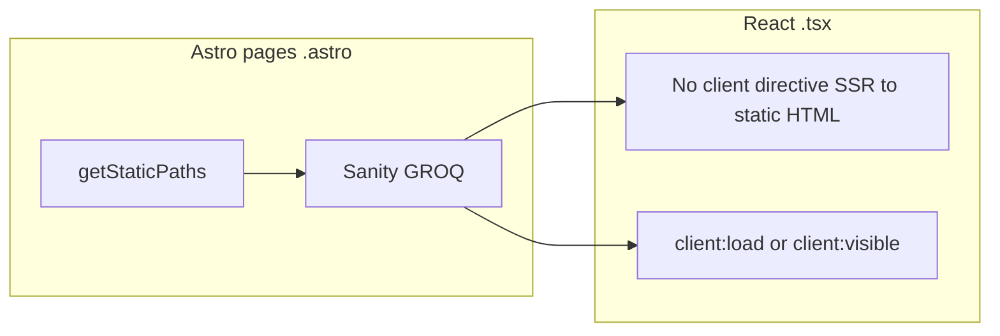

# Add React to Astro (`apps/web`) and migrate UI to React

## Classification (master-plan guardrails)

This is **Type B — dependency/tooling (bounded)**: add React as an Astro integration while keeping **Astro** as the site framework, **static** [`output: "static"`](apps/web/astro.config.mjs), **Sanity**, **npm**, and the documented Netlify model ([`docs/ws-j-deploy-ci-env.md`](docs/ws-j-deploy-ci-env.md)). It does **not** replace Astro or change CMS/hosting.

---

## Intent

- Replace imperative DOM scripts (`querySelector`, `aria-*` toggles, listeners) in [`Header.astro`](apps/web/src/components/Header.astro) and [`[locale]/resources/index.astro`](apps/web/src/pages/[locale]/resources/index.astro) with declarative React state and effects.
- Standardize on React for **presentational** components (header, footer, language switcher, page sections) so future interactivity does not scatter vanilla JS.
- Keep **no unnecessary client JS**: static markup can be React **without** a `client:*` directive (Astro SSR’s static HTML at build time).

---

## Scope boundaries

| In scope | Out of scope |
|----------|----------------|
| `apps/web` only: deps, `astro.config`, `tsconfig`, ESLint touch-ups if needed | `apps/studio` unless a shared types package is introduced later |
| React components under something like `apps/web/src/components/` (`.tsx`) | Replacing Astro pages with a different meta-framework (Next.js, etc.) |
| Preserve routing, `getStaticPaths`, GROQ/Sanity fetch in `.astro` pages | Phase 2 master-plan features (search, analytics, etc.) |
| Same URLs, i18n ([WS-B](.cursor/plans/tenant_union_website_plan_81e09108.plan.md)), and `publishedLocales` behavior | SSR adapters or `server` output unless you explicitly change deploy |

**Important architectural clarification:** “Refactor all existing files to use React” should mean **the UI component layer becomes React**; **page routes stay `.astro`** so `getStaticPaths`, Sanity fetching, and portable text → HTML stay idiomatic. Converting every `.astro` file into `.tsx` **routes** would fight Astro’s static pipeline and is **not** recommended.

**Reasonable exception:** [`RedirectShell.astro`](apps/web/src/components/RedirectShell.astro) is a minimal meta-refresh HTML document with no interactivity—**leave as Astro** unless you want uniformity at the cost of an unnecessary React runtime on that edge path.

---

## Current inventory (readonly snapshot)

- **15** `.astro` files under [`apps/web/src`](apps/web/src): 1 layout, 3 shared components, ~11 pages.
- **Vanilla `<script is:inline>`:** mobile nav in `Header.astro`; category filter in `[locale]/resources/index.astro`; one-time `sessionStorage` flag in `[locale]/index.astro`.
- **No scripts today:** `LanguageSwitcher.astro`, `Footer.astro`, most pages.

---

## Technical approach



1. **Dependencies:** `react`, `react-dom`, `@astrojs/react`, and `@types/react` / `@types/react-dom` (dev) in [`apps/web/package.json`](apps/web/package.json).
2. **Config:** Register `@astrojs/react()` in [`apps/web/astro.config.mjs`](apps/web/astro.config.mjs) (see [Astro React integration](https://docs.astro.build/en/guides/integrations-guide/react/)).
3. **TypeScript:** Extend [`apps/web/tsconfig.json`](apps/web/tsconfig.json) with `"jsx": "react-jsx"` (or align with base [`tsconfig.base.json`](tsconfig.base.json) `"jsx": "preserve"` + Astro’s expected setup—follow Astro’s generated defaults after `astro add react`).
4. **Static vs hydrated React:**
   - **Footer, LanguageSwitcher:** pure props → React components with **no** `client:*` (static HTML in the built site).
   - **Header:** split if helpful—e.g. shell SSR + **one** small island with `client:visible` or `client:load` for mobile menu state and `matchMedia` (mirror existing a11y: `aria-expanded`, Escape, focus).
   - **Resources list + filters:** one `ResourceListWithFilters` island receiving **serialized** props (categories, items with hrefs, dates as ISO strings)—avoid passing non-JSON-safe objects from Astro.
5. **Home `sessionStorage`:** either keep the tiny **inline script** (smallest JS) or a **minimal** `client:load` component that runs once—document the tradeoff (bundle vs purity).
6. **Styling:** keep [`global.css`](apps/web/src/styles/global.css) and existing class names on React-rendered DOM nodes so CSS changes stay minimal.
7. **Testing the contract:** `npm run build` / `npm run typecheck` in `apps/web`; spot-check mobile nav, resource filters, locale switch links, and RTL (`dir`) if applicable.

---

## Concrete file-level migration map

| Current | Target pattern |
|---------|----------------|
| [`components/Header.astro`](apps/web/src/components/Header.astro) | `Header.tsx` (+ optional `SiteHeaderNav.tsx` with `client:visible`) |
| [`components/LanguageSwitcher.astro`](apps/web/src/components/LanguageSwitcher.astro) | `LanguageSwitcher.tsx` (SSR-only) |
| [`components/Footer.astro`](apps/web/src/components/Footer.astro) | `Footer.tsx` (SSR-only) |
| [`layouts/BaseLayout.astro`](apps/web/src/layouts/BaseLayout.astro) | Still `.astro`; import React components |
| Page `.astro` files | Still `.astro`; pass fetched data as props into React components; remove inline scripts replaced by islands |
| [`RedirectShell.astro`](apps/web/src/components/RedirectShell.astro) | **Optional:** leave unchanged |

---

## Risks and mitigations

- **Bundle size:** each `client:*` island ships React runtime slices—keep islands **small** and prefer one island per page for interactivity when possible.
- **Duplicated San types:** share prop types in `src/types/` or next to components; pass plain objects from Astro.
- **ESLint:** root [`eslint.config.mjs`](eslint.config.mjs) may need `eslint-plugin-react-hooks` later; not blocking if typecheck + build pass.

---

## Workstreams for Cursor agent-led implementation

Suggested **sequential** order (dependencies flow downward). Use **one agent per workstream** or a single agent for WS1–WS3 if you want fewer handoffs.

### WS1 — Tooling and integration (foundation)

**Goal:** Build and typecheck with React; no feature migration yet.

**Tasks:** Add npm deps; `astro.config.mjs` integration; update `apps/web/tsconfig.json`; run `npm run typecheck` and `npm run build` on a stub empty fragment if needed.

**Exit criteria:** `astro build` succeeds; no React components required yet (can add a throwaway `Test.tsx` then delete).

---

### WS2 — Static shell components (SSR-only React)

**Goal:** Migrate zero-JS components to `.tsx` without `client:*`.

**Tasks:** Implement `Footer.tsx`, `LanguageSwitcher.tsx`; wire in `BaseLayout.astro` (and remove `.astro` counterparts when done).

**Exit criteria:** Visual parity; **no** extra client bundles for these (verify build output / Astro island behavior).

---

### WS3 — Interactive Header island

**Goal:** Replace [`Header.astro`](apps/web/src/components/Header.astro) script with React state/effects; preserve keyboard and `aria` behavior.

**Tasks:** Implement header markup in React; add `client:` directive only on the interactive subtree if splitting reduces JS.

**Exit criteria:** Mobile/desktop behavior matches current; no regressions on nav links or language switcher placement.

---

### WS4 — Resources page filter island

**Goal:** Replace [`[locale]/resources/index.astro`](apps/web/src/pages/[locale]/resources/index.astro) inline script with a React component.

**Tasks:** Serialize `resources` + `categories` for props; implement filter state; keep semantic structure (`role="group"`, `aria-pressed`).

**Exit criteria:** Filtering works; list items hidden with CSS/display consistent with a11y expectations.

---

### WS5 — Remaining pages (presentation consistency)

**Goal:** For each remaining `.astro` page, render main content through React **SSR** components where it improves consistency—**without** moving data fetching out of `.astro`.

**Tasks:** Introduce page-level `*.tsx` wrappers only where helpful (e.g. blog listing, event listing); keep `getStaticPaths` + fetch in `.astro`.

**Exit criteria:** No stray vanilla `<script>` except the optional home `sessionStorage` snippet (document decision).

---

### WS6 — Cleanup and hardening

**Tasks:** Remove obsolete `.astro` components; align ESLint if desired; run [`docs/launch-qa-checklist.md`](docs/launch-qa-checklist.md) relevant items (a11y, locales).

---

## Copy/paste prompt packets (per agent)

Use these as **fresh chat** prompts or sequential tasks. Paste the **Authoritative context** block once per session if the agent lacks repo access.

### Packet A — WS1 Tooling

```markdown
You are implementing WS1 only for the brtu-website monorepo.

Authoritative context:
- Site app: `apps/web` (Astro 5, static output, Netlify). Package manager: npm workspaces.
- Read `apps/web/astro.config.mjs` and `apps/web/tsconfig.json` before editing.

Task:
1. Add React support: `react`, `react-dom`, `@astrojs/react`, and `@types/react` + `@types/react-dom` (dev) to `apps/web/package.json` (install from repo root with `npm install -w apps/web …`).
2. Register `@astrojs/react` in `apps/web/astro.config.mjs`.
3. Update TypeScript config for JSX per Astro + React (follow official Astro “Add React” guidance).
4. Run `npm run typecheck` and `npm run build` for `apps/web`; fix any config issues.

Do not migrate components yet. Keep the diff minimal.
```

### Packet B — WS2 Static components

```markdown
You are implementing WS2 only for brtu-website `apps/web`.

Prerequisites: WS1 complete (React integration builds).

Task:
1. Convert `apps/web/src/components/Footer.astro` and `LanguageSwitcher.astro` to `.tsx` components with the same DOM/classes as today.
2. Import them from `apps/web/src/layouts/BaseLayout.astro` as React components **without** `client:*` so they SSR to static HTML.
3. Delete or stop using the old `.astro` files once wired.
4. Run `npm run typecheck` and `npm run build` in `apps/web`.

Match existing accessibility and `withLocalePath` / locale props behavior.
```

### Packet C — WS3 Header island

```markdown
You are implementing WS3 only for brtu-website `apps/web`.

Prerequisites: WS2 complete.

Task:
1. Replace `apps/web/src/components/Header.astro` with a React implementation that preserves layout, classes, logo, nav links, and integrates `LanguageSwitcher.tsx`.
2. Replace the vanilla `<script>` mobile menu logic with React (`useState`, `useEffect` for `matchMedia`, Escape key, click-away on links). Use a `client:visible` or `client:load` directive on the minimal subtree that needs hydration—avoid hydrating static links unnecessarily if you split components.
3. Update `BaseLayout.astro` imports.
4. Verify behavior at mobile and desktop breakpoints; preserve `aria-expanded`, toggle visibility, and focus behavior.
5. Run `npm run typecheck` and `npm run build`.

Remove `Header.astro` after parity.
```

### Packet D — WS4 Resources filter

```markdown
You are implementing WS4 only for brtu-website `apps/web`.

Prerequisites: WS1 complete (WS2/WS3 can be merged before this if Header already imports layout).

Task:
1. Refactor `apps/web/src/pages/[locale]/resources/index.astro` to remove the inline `<script is:inline>` category filter.
2. Add a React component (e.g. `ResourceDirectory.tsx`) that accepts serializable props: locale string, resources array (title, slug, summary, updatedAt ISO string, category slug/title), and category list.
3. Implement client-side filtering with React state; preserve button `aria-pressed` and the `role="group"` / `aria-labelledby` pattern.
4. Use `client:visible` or `client:load` on that component only.
5. Run `npm run typecheck` and `npm run build`.
```

### Packet E — WS5 Page consistency + WS6 Cleanup

```markdown
You are implementing WS5–WS6 for brtu-website `apps/web`.

Prerequisites: WS2–WS4 done (Header + Footer + LanguageSwitcher + Resources in React).

Task:
1. Audit remaining `apps/web/src/pages/**/*.astro` files; extract main content into SSR React components where it reduces duplication or aligns with the new pattern. **Keep** `getStaticPaths` and Sanity fetching in `.astro` files.
2. Decide on `[locale]/index.astro` sessionStorage snippet: keep minimal inline script OR replace with a tiny `client:load` component; document in commit message.
3. Optionally leave `RedirectShell.astro` unchanged; justify if so.
4. Remove dead `.astro` components and unused imports.
5. Run full `npm run typecheck`, `npm run build`, and `npm run lint` from repo root; fix issues.

Goal: no remaining vanilla `<script>` blocks except the explicitly allowed home redirect marker (if kept).
```

---

## Acceptance criteria (whole effort)

- `npm run build` and `npm run typecheck` pass for the monorepo scope you touch.
- Interactive behaviors: mobile nav, resource category filter, language links — **parity** with pre-React behavior.
- Static output unchanged in intent: still `output: "static"` and deployable per existing docs.
- New JS only where `client:*` is used; SSR-only React components do not add unnecessary client bundles.
