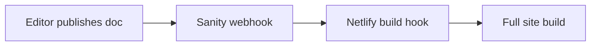
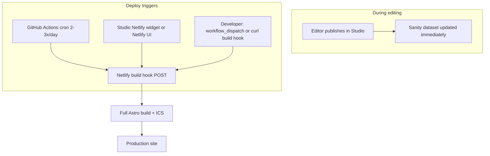

# Batch Sanity publishes into fewer Netlify deploys

## Problem (current state)

Your docs describe the intended flow: **Sanity webhook → Netlify build hook** on publish/unpublish ([`docs/ws-j-deploy-ci-env.md`](docs/ws-j-deploy-ci-env.md), [`docs/editor-handbook.md`](docs/editor-handbook.md)). Each published document fires one webhook, which starts a full `npm run build:web` ([`netlify.toml`](netlify.toml)) — including ICS generation (`apps/web/scripts/generate-event-ics.ts`) and static prerendering for most routes.

On Netlify’s **credit-based Free plan** (~300 credits/month), many small editing sessions can burn credits quickly because **each build consumes credits** regardless of how small the content change was.

**Important constraint:** Most content lives in **Sanity’s API**, not in git. **Merging a git branch does not publish CMS content.** Git branches only help for **code** previews (Netlify branch deploys), not for batching Sanity document publishes unless you add a separate “promote content” step (datasets/plugins/scripts).

---

## What does *not* solve this (or is out of scope)

| Approach | Verdict |
|----------|---------|
| **Sanity Content Releases** | Groups coordinated publishes, but is a **paid Enterprise add-on** (not on Free/Growth). Also has had reports of **multiple webhook events per release** — verify before relying on it for credit savings. |
| **Git branch staging → merge `main` on GitHub** | Only updates **code**. Editors still publish to Sanity; production site still needs a **build** (or SSR path) to pick up API content. |
| **“Cancel redundant builds” alone** | Helps overlapping builds, not **sequential** publishes minutes apart (each may still start and bill). |
| **More SSR only** | Events/resources already use `prerender = false` and fetch Sanity at request time ([`apps/web/src/pages/[locale]/events/index.astro`](apps/web/src/pages/[locale]/events/index.astro)), but **blog, pages, home, and `.ics` files remain build-time**. A full architecture shift to on-demand/ISR is **Type C** and does not remove rebuild need for calendars/static pages without broader approval. |

---

## Recommended strategy (matches your preferences)

**Hybrid: scheduled production deploys + on-demand overrides**

### 1. Disable the per-publish Sanity → Netlify webhook

In Sanity project settings, **remove or disable** the webhook that POSTs directly to the Netlify build hook URL. Content is still **live in Sanity** immediately; only the **public static site + ICS** lag until the next build.

Update [`docs/ws-j-deploy-ci-env.md`](docs/ws-j-deploy-ci-env.md) and [`docs/editor-handbook.md`](docs/editor-handbook.md) so editors expect delay and know how to **force deploy**.

### 2. Scheduled deploys (GitHub Actions — Type B)

Add a workflow (e.g. [`.github/workflows/deploy-web.yml`](.github/workflows/deploy-web.yml)) that:

- Runs on **cron** (example: `0 14,20 * * *` UTC = twice daily; tune to your timezone).
- POSTs to a **repository secret** `NETLIFY_BUILD_HOOK_URL` (never commit the hook URL).
- Uses `workflow_dispatch` so **developers can force a deploy** from the Actions tab.

This stays within the locked stack (Netlify + npm + existing `npm run build:web`), extends the documented deploy model, and caps routine deploys to **~2–4 builds/day**.

### 3. On-demand deploy for editor/admin (Type B)

Install and configure **`sanity-plugin-dashboard-widget-netlify`** (official, MIT) in [`apps/studio/sanity.config.ts`](apps/studio/sanity.config.ts):

- Requires `@sanity/dashboard` dashboard tool.
- Adds a **“Deploy”** button in Studio using Netlify **API ID + build hook ID** (store hook ID in env; do not hardcode secrets in git).
- Editors/admins trigger **one build** when a batch is done.

**Also document** Netlify UI path: Site → Deploys → **Trigger deploy** / build hook (for admins without Studio access).

### 4. Optional: debounced auto-deploy (if schedule feels too slow later)

If you later want “auto deploy ~10–15 minutes after the last publish” **without** going back to 1:1 webhooks:

- Point Sanity webhook at **GitHub `repository_dispatch`** (not Netlify).
- Workflow uses `concurrency: { group: deploy-debounce, cancel-in-progress: true }` + a **sleep** (e.g. 10 min): each new publish **resets the timer**; only the last quiet window triggers the build hook.

This is still Type B (GitHub + existing hook) and can coexist with cron (use one or the other to avoid double deploys).

---

## Alternative options (tradeoffs)

### A. Manual deploy only (simplest)

- Remove webhook; no cron.
- **Pros:** Minimum builds, zero new automation.
- **Cons:** Relies on discipline; stale site if nobody deploys.
- **Fit:** Very low publish frequency; you already chose scheduled + manual.

### B. Deploy-trigger document + filtered webhook

- Add a singleton (e.g. `siteSettings.deployRequestedAt`) or small `deployRequest` type.
- Sanity webhook **GROQ filter** only fires on that type.
- Custom Studio action **“Publish site”** updates the singleton once after a batch.
- **Pros:** Exactly one deploy per explicit editor action; no GitHub cron.
- **Cons:** Custom Studio code; editors must remember the extra step; still one build per button click (good).

### C. Dual Sanity datasets (staging vs production)

Free plan includes **2 public datasets**. Pattern:

- Editors publish to **`staging`** (no production webhook).
- Preview Netlify site (or branch) uses `PUBLIC_SANITY_DATASET=staging`.
- **Go live:** copy/promote documents to **`production`** (plugin e.g. cross-dataset duplicator, or maintainer script), then **one** production build hook.

- **Pros:** True content preview separate from live site; batch promotion possible with tooling.
- **Cons:** Highest editorial/training burden; duplication/asset IDs; not a simple “merge branch” UI for non-technical users without custom Studio actions.

### D. Reduce rebuild *need* (Type C — explicit approval)

- Expand SSR/on-demand fetching to more routes so **some** content updates without a full build.
- **ICS** and static marketing pages still need build or a new delivery strategy.
- Increases **function/SSR credit** usage on Netlify — trade build credits for runtime credits ([`.cursor/plans/members_only_real_concealment_seo_plan.md`](.cursor/plans/members_only_real_concealment_seo_plan.md) already discusses this tension).

### E. Spend money

- **Sanity:** Content Releases (Enterprise) — not aligned with staying on free Studio.
- **Netlify:** Pro tier for more credits / features — conflicts with “near-zero cost” master plan unless budget changes.

---

## Git branches: what they *can* do here

Use git branches **only for code**, not CMS batching:

| Use case | Git branch helpful? |
|----------|---------------------|
| Developer tests Astro/template changes | Yes — Netlify **branch deploy** or Deploy Preview on PR |
| Editor batches **content** publishes | **No** — unless paired with dataset promotion (option C) |
| Editor “merges staging to production” via GitHub UI | **No** for Sanity content |

A practical combo if you want a **staging website**: deploy preview site from a `staging` branch **and** point it at Sanity `staging` dataset — still requires a **promote + build** step for production, not a git merge alone.

---

## Implementation checklist (when you approve execution)

1. **Netlify:** Create/retain one build hook; store URL in GitHub secret `NETLIFY_BUILD_HOOK_URL`.
2. **Sanity:** Disable direct webhook to Netlify; optionally add `repository_dispatch` webhook only if implementing debounce later.
3. **Repo:** Add `deploy-web.yml` (cron + `workflow_dispatch`); document schedule in [`docs/ws-j-deploy-ci-env.md`](docs/ws-j-deploy-ci-env.md).
4. **Studio:** Add dashboard + Netlify widget; env vars for `NETLIFY_SITE_ID` / hook id (naming per plugin docs).
5. **Docs:** Update [`docs/editor-handbook.md`](docs/editor-handbook.md) — “Publish in Studio ≠ instant on website”; how to **Deploy site**; when to ask a developer to run Actions.
6. **Launch QA:** Replace “webhook on every publish” check in [`docs/launch-qa-checklist.md`](docs/launch-qa-checklist.md) with “scheduled + manual deploy verified”.

---

## Acceptance criteria

- Publishing **5 documents in a row** does **not** start **5** Netlify builds by default.
- **Scheduled** builds run at agreed times (2–4×/day configurable).
- **Editor or admin** can trigger **one** production build from Studio widget or Netlify UI without repo access.
- **Developer** can force deploy via GitHub Actions `workflow_dispatch` or build hook curl.
- Editor handbook explains delay and override paths.
- No new paid services; no Sanity plan upgrade required for the recommended path.

---

## Risks and notes

- **Stale content window:** Between scheduled builds, the live site shows previous build output. Mitigate with clear editor messaging and on-demand deploy after large batches.
- **Unpublish:** Same delay applies; urgent takedowns need **manual deploy** or temporary Sanity unpublish + deploy.
- **ICS/calendar links:** Still only update on full build — call this out for event editors.
- **Webhook secret:** If using GitHub `repository_dispatch`, validate Sanity webhook signature in the workflow.
- **Monitor credits:** After change, watch Netlify usage dashboard for a month to confirm savings.

---

## Classification

- **Type B (recommended path):** GitHub scheduled workflow, Studio Netlify widget, doc updates — bounded tooling on Astro + Sanity + Netlify + npm.
- **Type C (only if pursued later):** Broad ISR/SSR migration, second Netlify site + dual-dataset promotion automation, or leaving Netlify/Sanity free tiers.
