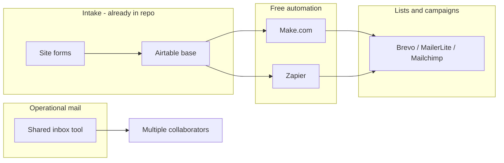

# Free email services: shared inbox, lists, and Airtable

## What you are optimizing for

You need three capabilities that vendors usually split across two product types:

| Capability | Typical product category | Free-tier reality |
|------------|-------------------------|-------------------|
| **Shared inbox** (many people, one address like `info@` or `support@`) | Help desk / shared inbox (Missive, Help Scout, Hiver) | Strong free options exist for small teams |
| **Email lists** (newsletters, segments, campaigns) | ESP / marketing (Brevo, MailerLite, Mailchimp) | Generous sending on free, but **almost always 1 login seat** |
| **Airtable integration** | Automation layer or sync tool | **No major ESP offers a native Airtable sync**; use Zapier, Make, or Outfunnel |

Your site already treats **Airtable as the intake layer** ([`AirTableFormEmbed.tsx`](apps/web/src/components/AirTableFormEmbed.tsx), [`siteSettings.ts`](apps/studio/schemas/documents/siteSettings.ts), [`event.ts`](apps/studio/schemas/documents/event.ts)). The most natural pattern is: **forms → Airtable → ESP for broadcasts**, plus a **separate shared inbox** for two-way mail.

---

## Important constraint: “multiple users” means different things

- **Shared inbox tools** count *agents/operators/seats* who answer mail together.
- **ESP free plans** (Brevo, MailerLite, Mailchimp) are typically **1 account user**; “collaboration” on lists is better done in **Airtable** (up to **5 editors** on a free workspace) with one ESP account synced via automation.
- **Buttondown** allows unlimited teammates but **Teams requires a paid plan** — not a fully free multi-user newsletter option.

---

## Comparison: shared inbox (free tiers)

Official or vendor-documented limits as of May 2026. “Collaborators” = people with their own login who can work the shared mailbox (not CC-only).

| Option | Active collaborators (free) | Shared inbox | List / campaign mgmt | Airtable path | Best when |
|--------|----------------------------|--------------|----------------------|---------------|-----------|
| [**Hiver**](https://hiverhq.com/pricing) | **Unlimited** (per Hiver pricing page) | Yes — Gmail/Outlook native | No | No native; paid tiers add integrations | You adopt **Gmail or Outlook** and want max free seats |
| [**Help Scout**](https://www.helpscout.com/pricing/) | **5 users** | 1 inbox; **100 “contacts”/mo** (people you reply to) | No (support only) | Zapier/marketplace on paid; not list-focused | Small support team, email-only helpdesk |
| [**Missive**](https://learn.missiveapp.com/faq/paypal) | **3 users** | Yes; 2 shared accounts; **15-day history** | No | Integrations on paid (**Productive**+) | ≤3 people, want chat + email in one UI |
| [**Google Groups Collaborative Inbox**](https://support.google.com/groups/answer/2464926) | **No hard cap** (practical ~2–20) | Yes with **Google Workspace** + custom domain | No | No | Already on or willing to pay **Workspace** (~$7+/user/mo) |
| [**Outlook shared mailbox**](https://support.microsoft.com/) | Unlimited *access* with M365 license | Yes (basic; no collision/assign on free feature set) | No | No | **Microsoft 365** shop |
| [**Crisp**](https://crisp.chat/en/pricing/) | **2 seats** | Shared inbox for **chat/forms**; **email inbox on paid** ($45/mo Mini) | Light CRM on paid | Integrations limited on free | Website chat-first, not email-first |
| [**FreeScout**](https://freescout.net/) (self-hosted) | **Unlimited agents** | Yes (Help Scout–like) | No | Webhooks / optional paid modules | You can host PHP/MySQL; $0 license |
| [**Freshdesk Free Program**](https://support.freshdesk.com/support/solutions/articles/50000010099) | **2 agents**, **6 months** then paid | Ticketing + shared email channel | No | Marketplace when paid | Short trial only — not a long-term free strategy |

**Freshdesk note:** The old permanent free tier was discontinued in 2025; current “Free Program” is **2 agents for 6 months**, then upgrade (~$15+/agent/mo).

---

## Comparison: email lists + Airtable (free tiers)

| Option | Account users (free) | List scale (free) | Segmentation / automation | Airtable integration |
|--------|---------------------|-------------------|---------------------------|----------------------|
| [**Brevo**](https://www.brevo.com/pricing/) | **1** | Store up to **100k** contacts; send **300 emails/day**; automations cap **2k** unique contacts in active automations | Lists, segments, automations (limited on free) | **Zapier** / **Make** templates (e.g. new/updated Airtable record → create/update Brevo contact); community tools like [Outfunnel](https://community.airtable.com/show-and-tell-15/sync-airtable-with-tools-like-mailchimp-klaviyo-brevo-pipedrive-and-more-47384) (Airtable → ESP, one-way) |
| [**MailerLite**](https://www.mailerlite.com/free-plan) | **1** | **1,000 subscribers**, **12,000 emails/month** | Automations, landing pages on free | Zapier/Make; multi-user only on **paid** plans |
| [**Mailchimp**](https://mailchimp.com/help/about-mailchimp-pricing-plans/) | **1** | **250 contacts**, **500 sends/month** | Very limited on free (no scheduling, heavy branding) | Zapier/Make |
| [**Airtable only**](https://support.airtable.com/v1/docs/getting-started-with-airtable-automations) | **5 editors** (free workspace) | Lists live as tables/views | Views + fields; **100 automation runs/mo** on free | Native — but **Send email** action on free only emails **verified base collaborators**, not your full list. For external recipients use **Gmail/Outlook automation actions** or sync to an ESP |

**Automation glue (free):**

- **Zapier Free:** ~**100 tasks/month**, **single-step** Zaps only — fine for “new Airtable row → add Brevo contact.”
- **Make Free:** ~**1,000 operations/month**, **multi-step** scenarios — better for tag-based routing and batch logic.
- **Airtable → ESP** is almost always **one-way** (Airtable as source of truth); plan a periodic export or Zap for unsubscribes unless you pay for two-way sync (Outfunnel advertises 2-way “soon”).

---

## Combined stacks by team size (all $0 software tiers)

Assume you will set up **Google Workspace or Microsoft 365** for `you@union.org` (not strictly free, but you said no org email yet — pick one stack and stay consistent).

### 2 people or fewer

| Layer | Pick | Why |
|-------|------|-----|
| Shared inbox | **Missive** (3 seats) or **Help Scout** (5 seats, 100 replies/mo) | Real shared inbox with assignment; Missive if you want in-thread team chat |
| Lists | **MailerLite** or **Brevo** | MailerLite: higher free sends; Brevo: larger stored list, lower daily send cap |
| Airtable | Existing forms + **Make** sync to ESP | Keeps both volunteers in Airtable; one ESP login is acceptable at this size |

### 3–5 people

| Layer | Pick | Why |
|-------|------|-----|
| Shared inbox | **Help Scout Free** (5 users) if volume &lt; 100 unique people helped/month; else **Hiver Free** (unlimited users, Gmail) | Help Scout wins on seat count; Hiver wins if reply volume exceeds 100 contacts/mo |
| Lists | **Brevo** + **Make** | Brevo storage headroom; Make’s 1k ops handles multi-step segment rules from Airtable views |
| Collaboration on data | **Airtable** (5 editors) | Where multiple people edit segments/tags without sharing ESP password |

### 6–10 people

| Layer | Pick | Why |
|-------|------|-----|
| Shared inbox | **Hiver Free** (unlimited users) + **Google Workspace** | Free shared-inbox seats stop scaling on Missive (3) and Help Scout (5) |
| Lists | **Brevo** (still 1 ESP user) or consider **paid MailerLite** only if you need **multiple ESP logins** | At this size, operational risk is one shared ESP account — mitigate with Airtable permissions and audit fields |
| Airtable | **Make**; monitor op usage | Complex syncs burn 1k ops quickly — design one scenario per list/view |

### 10+ people

| Layer | Reality on $0 |
|-------|----------------|
| Shared inbox | **Hiver Free** or **Google Collaborative Inbox** + Workspace; or **self-host FreeScout** if you have a volunteer sysadmin |
| Lists | Free ESPs break down on **seats** and **daily send caps** (Brevo 300/day, Mailchimp 500/month) — budget for **Brevo Starter** or **MailerLite Growing** when list or team grows |
| Airtable | Likely need **Airtable Team** (external email in automations) + paid Make/Zapier |

---

## Feature matrix (at a glance)

| | Collaborators (free) | Shared inbox | Lists / campaigns | Airtable |
|--|---------------------|--------------|-------------------|----------|
| Hiver | Unlimited | Strong | — | Indirect |
| Help Scout | 5 | Strong (low volume cap) | — | Indirect |
| Missive | 3 | Strong | — | Indirect |
| Brevo | 1 | — | Strong | Zapier/Make |
| MailerLite | 1 | — | Strong | Zapier/Make |
| Mailchimp | 1 | — | Weak free limits | Zapier/Make |
| Airtable + Make + ESP | 5 in base, 1 in ESP | — | Strong (in base) | Native hub |
| Google Collab Inbox | Many | Basic | — | — |
| FreeScout | Unlimited | Strong | — | Webhooks |

---

## Recommendations for a tenant-union site (practical default)

Given **no email provider yet**, **Airtable already in production**, and **flexible team size**:

1. **Register domain mail** on **Google Workspace** (simplest path to Hiver + Groups fallback).
2. **Operational mail:** start with **Hiver Free** (unlimited collaborators) on a shared address like `info@` or `organizing@`.
3. **Lists / newsletters:** **Brevo Free** as ESP; sync from Airtable with **Make** (new/updated record in a “Members” or “Subscribers” view → create/update Brevo contact; map tags from Airtable multi-select fields).
4. **Keep Airtable as the multi-user CRM** for list hygiene (5 editors); treat Brevo as send engine, not the place the whole committee logs in.
5. **Revisit when:** reply volume &gt; Help Scout–style limits, daily sends &gt; 300 (Brevo free), or you need &gt;3 people in Missive-only setup.

Optional later (not free): Help Scout or Missive paid if you want support metrics; Airtable Team if you must email arbitrary addresses from automations without Gmail/ESP.

---

## What this does *not* include (out of scope)

- Choosing or paying for **Google Workspace / Microsoft 365** (required for professional `@yourdomain` mail; not $0).
- **Transactional** mail (password reset, receipts) — use ESP transactional or Resend/SendGrid; separate from shared inbox.
- Wiring automations into [`brtu-website`](apps/web) code — only CMS embeds today; ESP sync is an ops/automation project in Airtable/Make, not a site code change unless you add webhooks later.

---

## Sources to verify before signup

- [Missive billing FAQ](https://learn.missiveapp.com/faq/paypal) — 3 users, 15-day history
- [Help Scout pricing](https://www.helpscout.com/pricing/) — 5 users, 100 contacts/month
- [Hiver pricing](https://hiverhq.com/pricing/) — unlimited users on Free
- [Brevo free plan limits](https://help.brevo.com/hc/en-us/articles/208580669)
- [MailerLite free plan](https://www.mailerlite.com/free-plan)
- [Mailchimp plan limits](https://mailchimp.com/help/about-mailchimp-pricing-plans/)
- [Airtable automation limits](https://support.airtable.com/v1/docs/getting-started-with-airtable-automations)
- [Zapier Airtable + Brevo](https://zapier.com/apps/airtable/integrations/brevo)
