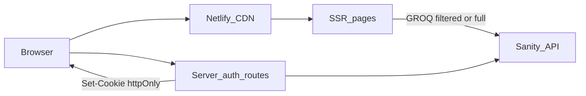

# Members area — final implementation plan

This is the **single implementation source of truth** for the members feature. Exploratory context lives in [`members-only_gated_content_afc5a424.plan.md`](members-only_gated_content_afc5a424.plan.md) (soft gating, superseded for this build) and [`members_only_real_concealment_seo_plan.md`](members_only_real_concealment_seo_plan.md) (requirements deep-dive + Netlify billing notes).

---

## Locked decisions (round 1)

| Topic | Decision |
|--------|-----------|
| **Track** | **Real concealment + SEO** — no members-only titles/bodies/list rows in HTML for unauthenticated requests; crawler-oriented controls (noindex, generic titles, sitemap hygiene). |
| **Hosting** | **Netlify server runtime approved** — `@astrojs/netlify`, `output: 'hybrid'` (or `'server'` if required), **server-only** secrets (no shared password in `PUBLIC_*`). |
| **Auth** | **Both** — shared password form **and** magic URL query param, both **validated on the server**; param stripped after successful session establishment (**redirect** after `Set-Cookie` preferred). |
| **Session** | **Long-lived** — httpOnly cookie on the order of **weeks to months** (e.g. 180-day signed payload with optional sliding refresh documented in code). |
| **SSR scope (v1)** | **Hybrid only** for **`/[locale]/events`**, **`/[locale]/events/[slug]`**, **`/[locale]/resources`**, **`/[locale]/resources/[slug]`**, and **`/[locale]/members`** (light SSR for login UI); other routes stay prerendered. |
| **Future members-only pages** | **Not in v1** — document an **extension pattern** (new route group + `prerender = false` + shared auth helper + optional `page.membersOnly` later). |
| **Studio help** | **`siteSettings.membersLoginHelp`** as **plain multiline text** (not portable text). |
| **Logout** | **Members page only** — explicit **Sign out** that **POST**s logout and clears cookie. |

---

## Locked decisions (round 2 — implementation detail)

| Topic | Decision |
|--------|-----------|
| **Unauthenticated member-only detail URL** | **HTTP 200 stub**: generic `<title>` / meta, “Members only” body, **`noindex, nofollow`** (meta or `X-Robots-Tag`). No 404 for v1. |
| **Members page** | **Light SSR** (`prerender = false`): server reads session cookie to show **Sign out** vs login form; still no secrets in HTML. |
| **Magic link token** | **Reusable** server secret `MEMBERS_MAGIC_LINK_TOKEN` (rotate by changing env when needed). **Not** one-time tokens in v1. |
| **Password in env** | **Plaintext** `MEMBERS_PASSWORD` in **server-only** Netlify env; compare in **constant-time** in the login handler (acceptable for v1 threat model). |
| **Auth transport** | **Astro server API routes** only (e.g. `src/pages/api/members/...` with `export const POST` / `GET`), deployed via `@astrojs/netlify` — **not** a separate `netlify/functions` tree unless we explicitly revisit portability. |

---

## Intent (product)

- Editors toggle **members only** on **events** and **resource categories** (default off).
- Unauthenticated visitors: **no** members-only events or member-category resources in **lists**; **no** sensitive detail in **HTML or `<head>`** for member URLs; **no** those events in **public ICS**.
- Authenticated members (password or magic link): full content on events/resources surfaces.
- **Members** in the top nav → **Members** page with help text, login, sign-out.
- **Sanity Studio** role unchanged; schemas + content only.

---

## Architecture summary



1. **Login/logout** — Astro server routes (with Netlify adapter): validate **`MEMBERS_PASSWORD`** / query token vs **`MEMBERS_MAGIC_LINK_TOKEN`**; issue **signed** session in **httpOnly, Secure, SameSite=Lax** cookie (long `Max-Age`).
2. **SSR pages** — Per request: invalid/missing cookie → **public** GROQ; valid cookie → **full** GROQ. Member-only **detail** without cookie → **stub + noindex** (200).
3. **Members page** — **SSR** for cookie-aware UI + forms POSTing to login/logout.
4. **Magic link** — Server **302** to clean URL after `Set-Cookie` (strip query server-side).

---

## Sanity Studio

| Document | Field |
|----------|--------|
| `event` | `membersOnly` boolean, default `false`; description: keep translations aligned with English source. |
| `resourceCategory` | `membersOnly` boolean, default `false`; same editor note. |
| `siteSettings` | `membersLoginHelp` — **text**, multiline, per locale. |

Optional: [`editorChecklistAction.tsx`](../apps/studio/actions/editorChecklistAction.tsx) reminder when `membersOnly` is true.

**GROQ convention:** `coalesce(membersOnly, translationOf->membersOnly, false)` for events; for resources use category projection with `coalesce(category->membersOnly, category->translationOf->membersOnly, false)` (exact shape in Step 2).

---

## GROQ and data loading

**File:** [`apps/web/src/lib/sanity/queries.ts`](../apps/web/src/lib/sanity/queries.ts)

- **Public** list/detail queries exclude members-only events and resources in members-only categories.
- **Full** list/detail queries include everything for authenticated SSR.
- **`allEventsForIcs`:** exclude members-only events.

---

## Astro + Netlify

- **`@astrojs/netlify`**, **`output: 'hybrid'`**.
- **`export const prerender = false`** on:
  - `apps/web/src/pages/[locale]/events/index.astro`
  - `apps/web/src/pages/[locale]/events/[slug].astro`
  - `apps/web/src/pages/[locale]/resources/index.astro`
  - `apps/web/src/pages/[locale]/resources/[slug].astro`
  - `apps/web/src/pages/[locale]/members/index.astro` (**new**)
- **Caching:** avoid CDN serving authenticated HTML as anonymous (`Cache-Control` / `Vary: Cookie` as appropriate).

---

## Auth and session

**Canonical approach:** implement login, logout, and optional “magic link bootstrap” as **Astro server endpoints** (HTTP handlers under `apps/web/src/pages/…`, `export const POST` / `GET` as appropriate) with **`@astrojs/netlify`**. Netlify still runs them as **serverless invocations**; this keeps one codebase, shared helpers with SSR pages, and same-origin cookies without maintaining a parallel `netlify/functions` API.

### Server-only environment (Netlify + local `.env`)

| Variable | Purpose |
|----------|---------|
| `MEMBERS_SESSION_SECRET` | Key for **signing** the session cookie (HMAC or JWT signing secret). **Never** `PUBLIC_*`. |
| `MEMBERS_PASSWORD` | Shared password; **plaintext** compare with **constant-time** helper (e.g. `crypto.timingSafeEqual` on equal-length buffers). **Never** `PUBLIC_*`. |
| `MEMBERS_MAGIC_LINK_TOKEN` | Secret value compared to query param (e.g. `?t=…`) for auto-login; **reusable** until env rotated. **Never** `PUBLIC_*`. |

Local dev: document in [`docs/ws-j-deploy-ci-env.md`](../docs/ws-j-deploy-ci-env.md) that these live in Netlify UI and optionally in **non-public** env files ignored by git (never commit).

### Session cookie

- **Name (v1):** e.g. `brtu_member_session` (single constant in code).
- **Attributes:** `HttpOnly`, `Secure` (production), `SameSite=Lax`, `Path=/`, **`Max-Age`** for long session (e.g. **~180 days** per locked decision).
- **Value:** signed opaque payload (e.g. JWT with `exp` / `iat` or HMAC of a random id + metadata). **No** PII. Validate signature on every SSR page that switches GROQ variant.
- **Invalid / expired signature:** treat as logged out (public GROQ only).

### HTTP routes (illustrative; adjust to Astro file routing)

- **`POST` login** — Body: password (form `application/x-www-form-urlencoded` or JSON). On success: `Set-Cookie` with session; **302** back to `Referer` or `/[locale]/members`. On failure: **401** with generic error (no “password wrong” oracle beyond generic message).
- **`POST` logout** — Clear session cookie (`Max-Age=0`); redirect to Members page or home.
- **Magic link bootstrap** — e.g. `GET /api/members/bootstrap` (or dedicated route) reads `t` query param; if `timingSafeEqual(t, MEMBERS_MAGIC_LINK_TOKEN)`, set session cookie and **302** to same path **without** query string (strip secret from URL). Wrong/missing token: **302** to Members login with no cookie set (or **404** — pick one; prefer redirect to Members to avoid enumeration noise).

### SSR pages (consumers)

- Events/resources Astro pages (and Members SSR) import a small **`getMemberSession(Astro)`** (or equivalent) that reads the cookie from the request, verifies signature/expiry, returns `authenticated: boolean`. **No** session logic duplicated in client JS for security decisions.

### CSRF / abuse (v1 baseline)

- **SameSite=Lax** + same-origin POST forms from the Members page is acceptable for v1.
- Optional later: rate limit login POST (Netlify edge or external) — **out of scope** unless requested.

### What not to do

- Do **not** put `MEMBERS_PASSWORD` or `MEMBERS_MAGIC_LINK_TOKEN` in **`PUBLIC_*`** or client bundles.
- Do **not** use **localStorage** as the sole session store for this track (concealment + SEO require server-verified cookie for SSR branching).

---

## SEO (v1 checklist)

| Case | Behavior |
|------|----------|
| Unauthenticated **list** pages | HTML lists **public** rows only. |
| Unauthenticated **member-only detail** | **200 stub**, generic head, **`noindex, nofollow`**. |
| **Sitemap** | Omit member-only URLs from any **public** sitemap. |
| **ICS** | Public ICS excludes members-only events. |

---

## Agent-led implementation phases (ordered)

| Step | Title | Goal |
|------|--------|------|
| **1** | Sanity schemas | `membersOnly` + `membersLoginHelp`; Studio compiles; optional checklist. |
| **2** | GROQ + ICS | Public/full queries + `allEventsForIcs` filter; type shapes for next steps. |
| **3** | Astro + Netlify hybrid | Adapter, `output: 'hybrid'`, `prerender = false` on five routes; `npm run build` passes (may still serve public-only data until Step 5). |
| **4** | Auth routes + session | Login/logout endpoints, cookie signing, constant-time password check, magic token path for redirect bootstrap. |
| **5** | SSR events + resources | Wire cookie → query variant; detail stubs + noindex when unauthenticated + members-only doc. |
| **6** | Members UI + nav | Members page SSR, forms, magic-link entry, [`HeaderNav.tsx`](../apps/web/src/components/HeaderNav.tsx) link. |
| **7** | Docs + SEO sweep | [`docs/ws-j-deploy-ci-env.md`](../docs/ws-j-deploy-ci-env.md), sitemap/robots if present, curl checklist. |

---

## Mandatory rule after every implementation step

The agent (or human) completing a step **must** edit **this file** — [`.cursor/plans/members_area_final_implementation_plan.md`](members_area_final_implementation_plan.md) — and append:

1. **`### Step N — Implementation log (YYYY-MM-DD)`**  
   - **Merged PR / branch** (if any)  
   - **Files touched** (paths)  
   - **Behavioral outcome** (what works now)  
   - **Deploy notes** (e.g. “run `npm run deploy:studio` after Step 1”)  
   - **Follow-ups / risks** discovered  

2. **`### Context updates for downstream steps`**  
   - Any renamed env vars, schema fields, or route paths  

3. **`### Step N+1 — Prompt packet (copy-paste for next agent)`**  
   - A **fresh, complete** copy-paste block for the next step, revised if Step N changed assumptions.  
   - If nothing material changed, the implementing agent may copy the **pre-generated** packet from the “Step packet library” below and adjust only filenames or env names.

Failure to update this plan is treated as **incomplete work** for the step.

---

## Step packet library (pre-generated; revise in logs if needed)

### Step 2 — Prompt packet (copy-paste after Step 1 completes)

```markdown
## Task: Members area — Step 2 (GROQ + ICS)

Authoritative plan: repo file `.cursor/plans/members_area_final_implementation_plan.md` (read Locked decisions + Phase table).

### Scope
- Update `apps/web/src/lib/sanity/queries.ts`:
  - Add coalesced `membersOnly` for events (`coalesce(membersOnly, translationOf->membersOnly, false)`).
  - Extend resource projections so each resource exposes an effective **categoryMembersOnly** (from category + translationOf) for filtering.
  - Provide **public** variants of: upcoming/past events, events by slug, resources by locale, resource by slug — each excludes members-only rows or member-category resources where appropriate for **anonymous** HTML.
  - Provide **full** variants (or parameterized queries) used when session is valid (Step 5 will consume).
  - Update `allEventsForIcs` to exclude members-only events.
- Update `apps/web/scripts/generate-event-ics.ts` if query exports or types change.
- **Do not** add Netlify adapter yet unless needed for typecheck; prefer Step 3 for adapter.

### Constraints
- Minimal diffs; keep existing query naming patterns; add tests only if repo already uses them for queries (otherwise skip).
- Run `npm run typecheck` from repo root before finishing.

### Mandatory: update master plan
Append to `.cursor/plans/members_area_final_implementation_plan.md`:
1. `### Step 2 — Implementation log (YYYY-MM-DD)` …
2. `### Context updates for downstream steps` …
3. `### Step 3 — Prompt packet (copy-paste for next agent)` — regenerate fully (use Step 3 outline: Netlify hybrid + prerender flags on five routes; build must pass).
```

### Step 3 — Outline for the next agent to turn into a full packet

- Add `@astrojs/netlify`, set `output: 'hybrid'`, configure adapter in `apps/web/astro.config.mjs`.
- Add `export const prerender = false` to the five Astro pages listed in this plan (create stub `members/index.astro` if not created yet — minimal placeholder is OK).
- Ensure `npm run build` from monorepo root passes.

---

## Step 1 — Prompt packet (**copy-paste below**)

```markdown
## Task: Members area — Step 1 (Sanity schemas only)

Authoritative plan: `.cursor/plans/members_area_final_implementation_plan.md`. Read **Locked decisions (round 1 + round 2)** and **Agent-led implementation phases** before coding.

### Scope (strict)
- **`apps/studio` only.** Do **not** modify `apps/web`, `packages/*`, or CI/docs in this step unless a schema registration file under `apps/studio` requires a one-line import.
- Add boolean field **`membersOnly`** (default `false`, sensible `title`/`description`) to:
  - `apps/studio/schemas/documents/event.ts`
  - `apps/studio/schemas/documents/resourceCategory.ts`
- Add **`membersLoginHelp`** to `apps/studio/schemas/documents/siteSettings.ts` as **multiline plain `text`** (not `richText`), with Studio description explaining it appears on the public Members login page.
- Ensure new fields are exported/registered via `apps/studio/schemas/index.ts` (or existing pattern) if required.
- **Optional:** extend `apps/studio/actions/editorChecklistAction.tsx` with a non-blocking reminder when `membersOnly` is true.

### Out of scope
- No GROQ, no Astro, no Netlify, no env vars in `docs/ws-j-deploy-ci-env.md` yet.

### Verification
- From repo root: `npm run typecheck` (or studio-specific check if documented in root `package.json`).
- Sanity Studio starts without schema errors (`npm run dev` in `apps/studio` if that is the local convention).

### Mandatory: update master plan when done
Edit `.cursor/plans/members_area_final_implementation_plan.md` and **append** (do not delete prior content):

1. `### Step 1 — Implementation log (YYYY-MM-DD)`  
   - List every file changed.  
   - Note whether hosted Studio deploy (`npm run deploy:studio` from repo root) is required before editors see fields.  

2. `### Context updates for downstream steps`  
   - Exact **field API names** as stored in Sanity (`membersOnly`, `membersLoginHelp`).  

3. `### Step 2 — Prompt packet (copy-paste for next agent)`  
   - Either paste the **Step 2 packet** from the “Step packet library” in the master plan, **or** a revised version if your schema names differ.  
   - The packet must include the same **Mandatory: update master plan** tail pointing to Step 3.

Do not start Step 2 in the same PR unless explicitly asked.
```

---

## Testing and acceptance (full feature)

- `curl` / View Source: unauthenticated events/resources HTML has **no** member-only list rows or titles.
- Unauthenticated **member-only detail**: **200** stub + **noindex** + generic `<title>`.
- Authenticated `curl` with cookie: full content.
- ICS: no member-only events.
- Studio: fields visible; help text publishable per locale.

---

## Billing reminder

See [`members_only_real_concealment_seo_plan.md`](members_only_real_concealment_seo_plan.md) — SSR + Functions are included on Netlify Free **within credits**; Open Source plan is separate.

---

## Out of scope (v1)

- Per-user accounts, one-time magic tokens, password hashing in env.
- Members-only marketing `page` documents (extension pattern only).

---

## References

| Document | Use |
|----------|-----|
| [`members_only_real_concealment_seo_plan.md`](members_only_real_concealment_seo_plan.md) | SEO + billing detail |
| [`members-only_gated_content_afc5a424.plan.md`](members-only_gated_content_afc5a424.plan.md) | Historical soft-gating |
| [`docs/ws-j-deploy-ci-env.md`](../docs/ws-j-deploy-ci-env.md) | Deploy/env |
| [`docs/cursor-plan-mode-prompt.md`](../docs/cursor-plan-mode-prompt.md) | Type C guardrails |

---

### Step 1 — Implementation log (2026-05-12)

- **Branch / PR:** local implementation (no PR number).
- **Files changed:**
  - [`apps/studio/schemas/documents/event.ts`](../apps/studio/schemas/documents/event.ts) — added `membersOnly` boolean (`initialValue: false`).
  - [`apps/studio/schemas/documents/resourceCategory.ts`](../apps/studio/schemas/documents/resourceCategory.ts) — added `membersOnly` boolean (`initialValue: false`).
  - [`apps/studio/schemas/documents/siteSettings.ts`](../apps/studio/schemas/documents/siteSettings.ts) — added `membersLoginHelp` (`type: "text"`, `rows: 4`).
  - [`apps/studio/actions/editorChecklistAction.tsx`](../apps/studio/actions/editorChecklistAction.tsx) — checklist accepts `draft`; extra lines when `membersOnly` is true for `event` and `resourceCategory`.
- **Behavioral outcome:** Studio schema includes members fields; hosted Studio **does not** show them until schema is deployed.
- **Deploy notes:** Run **`npm run deploy:studio`** from the repo root (or your documented Studio deploy path) so **Sanity-hosted Studio** picks up the new fields. Local `npm run dev` in `apps/studio` shows fields immediately.
- **Follow-ups:** Step 2 must project `membersOnly` / category flags in GROQ for `apps/web`.

### Context updates for downstream steps

- **Sanity field names (API / GROQ):** `membersOnly` on types **`event`** and **`resourceCategory`**; **`membersLoginHelp`** on **`siteSettings`** (plain string in API, multiline text in Studio).
- **`schemas/index.ts`:** unchanged — `event`, `resourceCategory`, and `siteSettings` were already registered.

### Step 2 — Prompt packet (copy-paste for next agent)

```markdown
## Task: Members area — Step 2 (GROQ + ICS)

Authoritative plan: repo file `.cursor/plans/members_area_final_implementation_plan.md` (read Locked decisions + Phase table).

### Scope
- Update `apps/web/src/lib/sanity/queries.ts`:
  - Add coalesced **`membersOnly`** for events: `coalesce(membersOnly, translationOf->membersOnly, false)` (field name in API: **`membersOnly`**).
  - Extend resource projections so each resource exposes an effective **category-level members flag** (e.g. `categoryMembersOnly`) using `coalesce(category->membersOnly, category->translationOf->membersOnly, false)` on the referenced **`resourceCategory`**.
  - Provide **public** variants of: upcoming events, past events, event by slug, resources by locale, resource by slug — each suitable for **anonymous** HTML (exclude members-only events; exclude resources whose category is members-only).
  - Provide **full** variants (or parameterized queries) for when a valid member session exists (Step 5 will consume).
  - Update **`allEventsForIcs`** to exclude members-only events (same coalesce rule).
- Update `apps/web/scripts/generate-event-ics.ts` if query exports or TypeScript types change.
- **Do not** add the Netlify adapter yet unless typecheck forces it; Step 3 owns adapter install.

### Constraints
- Minimal diffs; keep existing query naming patterns; add tests only if the repo already tests GROQ helpers.
- Run **`npm run typecheck`** from repo root before finishing.

### Mandatory: update master plan
Append to `.cursor/plans/members_area_final_implementation_plan.md`:
1. `### Step 2 — Implementation log (YYYY-MM-DD)` — files, query names added, ICS behavior.
2. `### Context updates for downstream steps` — exact **exported query constant names** for public vs full (so Step 3–5 import the right symbols).
3. `### Step 3 — Prompt packet (copy-paste for next agent)` — full packet: install `@astrojs/netlify`, `output: 'hybrid'`, `prerender = false` on the five routes in the plan (create minimal `members/index.astro` if missing), **`npm run build`** must pass; then same mandatory append chain for Step 4 (auth routes per **Auth and session** section of the master plan).

Do not start Step 3 in the same PR unless explicitly asked.
```

---

### Step 2 — Implementation log (2026-05-12)

- **Branch / PR:** local (no PR number).
- **Files changed:**
  - [`apps/web/src/lib/sanity/queries.ts`](../apps/web/src/lib/sanity/queries.ts) — Public/Full query pairs for events and resources; `allEventsForIcs` excludes members-only; `siteSettingsByLocale` projects `membersLoginHelp`; `resourceCategoriesByLocale` includes `membersOnly` + new `resourceCategoriesByLocalePublic`; file header comments document naming.
  - **`apps/web/scripts/generate-event-ics.ts`:** unchanged (imports `allEventsForIcs`; filter lives in the query).
- **Behavioral outcome:** ICS build omits members-only events. Legacy exports (`upcomingEventsByLocale`, etc.) alias **Full** queries (prior behavior for which rows exist, plus new projected fields). **Public** variants ready for Step 5.
- **Deploy notes:** None.
- **Follow-ups:** Step 5 switches pages to Public/Full by cookie; until then prerendered pages using legacy aliases may still emit members-only content in HTML.

### Context updates for downstream steps

**Exported constants** (`apps/web/src/lib/sanity/queries.ts`): `upcomingEventsByLocalePublic` / `upcomingEventsByLocaleFull`, `pastEventsByLocalePublic` / `pastEventsByLocaleFull`, `eventBySlugAndLocalePublic` / `eventBySlugAndLocaleFull`, `resourcesByLocalePublic` / `resourcesByLocaleFull`, `resourceBySlugAndLocalePublic` / `resourceBySlugAndLocaleFull`, `eventsByLocalePublic` / `eventsByLocaleFull`, `resourceCategoriesByLocalePublic`; legacy `upcomingEventsByLocale`, `pastEventsByLocale`, `eventBySlugAndLocale`, `resourcesByLocale`, `resourceBySlugAndLocale`, `eventsByLocale` = **Full**. Resource rows include **`categoryMembersOnly`** and expanded **`category`**. **`allEventsForIcs`** filtered. **`siteSettingsByLocale`** includes **`membersLoginHelp`**.

### Step 3 — Prompt packet (copy-paste for next agent)

```markdown
## Task: Members area — Step 3 (Astro + Netlify hybrid)

Authoritative plan: `.cursor/plans/members_area_final_implementation_plan.md` — read **Astro + Netlify**, **SSR scope**, and **Locked decisions**.

### Scope
- In `apps/web`: add **`@astrojs/netlify`**, set **`output: 'hybrid'`**, configure the Netlify adapter in `astro.config.mjs` per current Astro docs.
- Set **`export const prerender = false`** on:
  - `apps/web/src/pages/[locale]/events/index.astro`
  - `apps/web/src/pages/[locale]/events/[slug].astro`
  - `apps/web/src/pages/[locale]/resources/index.astro`
  - `apps/web/src/pages/[locale]/resources/[slug].astro`
  - **Create** `apps/web/src/pages/[locale]/members/index.astro` (minimal SSR placeholder: `BaseLayout` + heading “Members”).
- **`npm run build`** from **repo root** must succeed.

### Out of scope
- Auth/session (Step 4), Public vs Full fetch switching (Step 5), HeaderNav (Step 6).

### Verification
- `npm run build` at monorepo root.

### Mandatory: update master plan
Append `### Step 3 — Implementation log`, `### Context updates`, `### Step 4 — Prompt packet` (auth per master plan **Auth and session**).

Do not implement Step 4 in the same PR unless explicitly asked.
```
