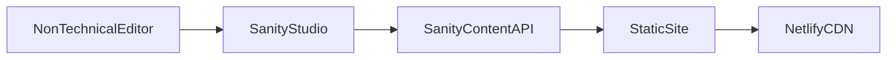
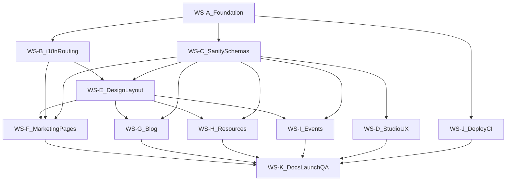

# Tenant union website — phased implementation plan

## Context locked from intake

- **Organization**: Volunteer neighborhood tenant union; primary goal is **recruiting/informing potential new members**; secondary goals are **search visibility**, **public events**, and **downloadable resources**.
- **Audience**: Local residents; **multilingual** is a **must-have**.
- **Timeline**: **Soft** target ~**1 month** (plan assumes aggressive MVP sequencing).
- **Budget**: **As close to $0 as possible** (favor free tiers: Netlify + Sanity free/team trial paths; minimal paid services).
- **Editor**: **One non-technical** user; needs **templates**, **guardrails**, **revision history**, **inline CMS help**, and **training docs**.
- **Tech preferences**: **[Sanity Studio](https://www.sanity.io/)** for CMS; **[Netlify](https://www.netlify.com/)** for hosting.
- **Initial content**: **None** yet (greenfield content modeling and seed workflows matter more than migration).

## Phase 0 decisions (resolved)

1. **Languages and parity** — **Launch with English only**, then add **Spanish, Arabic, Chinese**, and additional locales over time. The content model and routing must support **both** patterns:
   - **Partial translation**: some documents exist only in English (or only in some locales); the public site shows **fallback** (typically English) where a translation is missing, with clear UX (e.g., “not available in [lang]” or silent fallback — pick one convention in Phase 0).
   - **Full parity**: when a locale is required for a page or content type, editors can create **complete** translations (document-level or field-level, see architecture).
2. **Contact** — **Phase 1 includes** a **Contact** page with **mailto** plus **either** optional **Netlify Forms** (respecting free-tier limits) **or** an **embedded Google Form** (zero backend). **Forms must be translatable**: copy, labels, help text, and success/error messaging are **driven from Sanity per locale** (Netlify path); for **Google Forms**, prefer **one form per locale** embedded via locale-specific URL fields in CMS, or a single form with an explicit **language** field — choose based on editor simplicity (document both in the editor handbook).
3. **Still open / default** — **Search** remains `U`: default is **defer sitewide search** to Phase 2 unless content volume grows quickly; rely on **clear IA + filters** on resources/events.

## Recommended architecture (high level)



- **Frontend**: Static site (e.g., **Astro** or **Next.js** static export) deployed on Netlify, fetching content at build time (and optionally **ISR/webhooks** later if needed — start simple).
- **CMS**: Sanity schemas for **singletons** (site settings), **pages** (Home/About), **posts** (blog/news), **resources** (files + metadata), **events** (list + detail).
- **i18n**: Use Sanity’s **internationalization** in a way that supports **partial and full parity**: **document-level translations** (recommended default) with a **translation metadata** pattern (e.g., “translation of” link between locale variants) so the site can **fallback** when a locale document is missing. **Locale-prefixed routes** on Netlify (e.g. `/en/...`, `/es/...`, `/ar/...`, `/zh/...`) with **English as default** at launch; add locales to the build config as they go live. Optional: **field-level** translation only if a few fields need localization inside one document — avoid mixing patterns without a documented rule.
- **Media**: Sanity **asset pipeline** for images; **files** as downloadable assets with stable slugs/IDs for “replace file, same public URL” (implement via **stable document + replace asset** pattern, not unstable filenames).
- **Events “add to calendar”**: Generate **ICS** from event fields; provide **Google Calendar URL** builder links. No RSVP in MVP unless required later.

## Content model (MVP)

**Must-have types**

- **Site settings**: org name, short description, nav links, social links, default locale, optional alert banner.
- **Page** (structured): Home + About + **Contact** as documents (or singletons) with modular blocks if needed later. **Contact** includes per-locale **intro copy**, **mailto** target(s) if they differ by locale, and **form mode** (Netlify vs embedded Google) with **locale-specific field labels** or **per-locale embed URLs**.
- **Post**: title, slug, body (rich text), hero image, gallery, embeds (YouTube/Vimeo), optional audio (nice-to-have field can exist but can be unused at launch).
- **Resource**: title, slug, summary, **topic/category** (taxonomy), file attachment(s), **last updated**, optional related links.
- **Event**: title, slug, start/end, timezone, location (text + optional map link), description, **CTA** (e.g., meeting link), **ICS + Google link** derived at build time.

**Editor guardrails (from intake)**

- **Required fields** + validation messages in Studio.
- **Publishing checklist** (custom document actions or studio structure) covering: title/slug, alt text for hero, language, event time zone, resource file attached, etc.
- **Templates**: initial “starter” documents or Studio **initial values** for post/event/resource.
- **Revision history**: Sanity **revision history** (and/or **draft/published** workflow even if single editor — helps safety).

## Phased delivery

### Phase 0 — Discovery and foundations (2–4 days)

**Outcomes**

- **i18n rollout**: `en` only in repo/build at MVP launch; **add `es`, `ar`, `zh`** (and more) without schema rewrites — document **fallback behavior** and editor workflow for partial vs full parity.
- Information architecture: nav, URL scheme, homepage story for new members.
- UX/visual direction: accessible color system, typography, components (even if “design system from scratch” is lightweight).
- **Contact**: chosen stack (Netlify Forms vs Google embed) and **translatable form** pattern documented for the editor.
- Sanity project + Netlify site scaffolding; environments documented.

**Key tasks**

- Implement **locale list** and **fallback** rules (missing translation → English vs explicit notice).
- Define taxonomies for resources (and whether blog categories/tags ship in MVP or Phase 2).
- Specify **Contact** CMS fields: mailto, optional Netlify form field names + **per-locale labels**, or **per-locale Google Form URLs** / shared form + language field.
- Accessibility baseline checklist mapped to WCAG 2.1 AA for templates actually used in MVP (including **RTL** readiness for Arabic when that locale ships).

### Phase 1 — MVP launch (must-haves) (~2–3 weeks, parallelizable)

**Included (mapped to intake `M`)**

- Pages: **Home**, **About**, **Contact** (mailto + optional Netlify Forms or embedded Google Form; **form copy and labels translatable** via CMS).
- **Blog/news** with rich text, images/galleries, video embeds.
- **Resources library** with categories/topics, downloads, **replace file** workflow preserving stable public reference.
- **Events**: **list + detail**, **add-to-calendar** (ICS + Google link pattern).
- **Multilingual** architecture: **English-first** public site at launch; **add locales incrementally** with support for **partial translation** and **full parity** per document.
- **Mobile-first** responsive UI; **WCAG 2.1 AA** targeted for core templates.
- **SEO basics**: **clean slugs**, sensible titles/meta via code defaults (even if per-field SEO inputs are Phase 2).
- **Editor experience**: Studio structure, help text, templates, required fields, revision history, rollback path documented.
- **Training documentation**: short editor handbook + “how to publish” checklist.

**Explicitly deferred (intake `N` or `U`)**

- Calendar month grid view, recurring events, scheduled publishing, blog categories/tags (unless trivially added), XML sitemap controls UI, redirects tooling, analytics choice, spam/CAPTCHA specifics, schema/OG enhancements, backups policy automation.

**Acceptance tests (launch gate)**

- Editor can publish a post with images + embedded video without developer help.
- Contact page: mailto works; form path (Netlify or Google) works; **non-English** locale shows correct translated labels when that locale’s Contact document (or form) exists.
- Editor can add a resource with category and swap the file while the site still points to the same resource page.
- Editor can create an event; public page shows correct local time behavior; ICS downloads/opens.
- Spot-check accessibility: keyboard nav, focus states, heading order, alt text enforcement on key images.
- Lighthouse sanity pass on Home/Post/Event/Resource (not a substitute for full audit).

### Phase 2 — Growth and quality (~1–2 weeks after launch)

**Typical additions (based on `N`/`U`)**

- **Sitewide search** (e.g., Pagefind/Algolia free tier/Sanity search — pick based on cost/complexity).
- **FAQ** page type or structured FAQs.
- **SEO fields** in CMS for fine control; **Open Graph** images per content type.
- **Schema.org** for Organization/Article/Event (incremental SEO win).
- **Newsletter**: integrate a free-friendly option (e.g., **Buttondown**, **MailerLite** free tier, **Brevo** free tier) with signup component; document provider choice tradeoffs.
- **Analytics**: privacy-minded default recommendation (often **Plausible** paid vs **GA4** free — decide based on privacy tolerance).
- **Spam protection** if forms exist (Netlify honeypot / Turnstile if needed).
- **Resource filters/sorting** if library grows.

### Phase 3 — Handoff hardening and optional premium UX

**Goals**

- **Operational resilience** on a $0 mindset: documented backups/export, upgrade path, content governance.
- **Handoff package**: Studio onboarding, “break-glass” admin steps, where domains/DNS live, how to add a translator/editor role later.
- Optional: **dark mode**, richer calendar UI, recurring events, RSVP, private resources, advanced editorial workflows.

## Workstreams for agent-led implementation

Use this to split work into **reviewable chunks**. For each workstream, answer its **discovery questions** (you can paste answers into a chat or a short `NOTES.md`), then ask the agent to produce a **workstream implementation plan** (tasks, files touched, acceptance criteria) before coding.

### Discovery answers already locked (WS-A, WS-B, WS-C)

- **WS-A**:
  - Monorepo: `apps/web` + `apps/studio`
  - Package manager: `npm`
  - Frontend framework: `Astro`
  - TypeScript stance: prefer readability over strictest typing
  - Secrets: root `.env` for local dev; CI env vars in deployment platform
  - License (finalized): non-commercial, share-alike posture using:
    - **Code**: `PolyForm-Noncommercial-1.0.0`
    - **Content/media/docs**: `CC-BY-NC-SA-4.0`
    - Note: non-commercial restriction means this is **source-available**, not OSI open-source.
- **WS-B**:
  - Fallback UX: **silent English**
  - English URL: **`/en/...`**
  - Language switcher: show only locales with published content
  - Default language behavior: detect browser language **once per session on first site visit anywhere**; if locale unavailable, default to English; user can manually switch locale in UI
  - Chinese target: **Simplified** first
  - Arabic typography: system font is acceptable initially
  - Slugs: localized slugs for events/posts; non-localized/no-locale URLs redirect to English canonical route
  - Routing precedence (final):
    - no-locale URL -> `/en/...`
    - browser-language detection once per session on first site hit
    - if detected locale has no published version -> English
    - localized URL missing translation -> redirect to English version of the same document; if no English document exists, return 404
- **WS-C**:
  - Contact page mode for v1: **Netlify Forms**
  - Resource taxonomy: **flat categories**
  - Resource files: allow common document/image MIME types; large media (especially video) should be externally hosted (e.g., YouTube)
  - Rich text: default/typical Portable Text features only (headings, lists, links, basic embeds)
  - Resource attachments: **single file** per resource
  - Events: **no all-day support** in MVP
  - Home CTA fields: no required join/donate/meeting CTA fields

**Suggested flow**

1. Complete **WS-A** first (everything else assumes it).
2. Run **WS-B** and **WS-C** in parallel once the repo exists.
3. **WS-D** after core schemas exist (can overlap late in WS-C).
4. **WS-E** can start once routing skeleton exists (early WS-F stub).
5. **WS-F / G / H / I** can parallelize after **B + C + E** foundations are stable.
6. **WS-J** early for secrets pattern; wire **webhooks** when content builds should auto-refresh.
7. **WS-K** last (plus continuous partial QA during F–I).

### Workstream status tracker

Use statuses: `not started`, `planning`, `in progress`, `done`, `blocked`.

- `WS-A` Foundation and repository layout — `done`
- `WS-B` Internationalization and URL strategy — `done`
- `WS-C` Sanity content model (schemas) — `done`
- `WS-D` Studio desk structure and editor guardrails — `not started`
- `WS-E` Design system, global chrome, accessibility — `not started`
- `WS-F` Marketing pages (Home, About, Contact) — `not started`
- `WS-G` Blog/news — `not started`
- `WS-H` Resources library — `not started`
- `WS-I` Events — `not started`
- `WS-J` Deploy, CI/CD, webhooks, operations — `done`
- `WS-K` Editor handbook, training, launch QA — `not started`

**Dependency sketch**



## Cursor execution playbook (detailed)

Use this process each time you implement a workstream through Cursor so context is preserved and plans stay consistent with the broader architecture.

### 1) Should you start a new agent per workstream?

- **Yes, start a fresh agent for each workstream implementation plan** (`WS-A`, `WS-B`, etc.).
- Keep one chat for planning and one execution thread per workstream when practical.
- Use a fresh agent when:
  - scope changes substantially (e.g., from schemas to deployment),
  - different file areas are involved,
  - you need a clean decision trail for review.
- Reuse the same workstream agent only for small follow-up edits within that same scope.

### 2) Minimum context packet to provide every time

When asking Cursor to plan or implement a workstream, include:

- Link/path to this master plan: [`.cursor/plans/tenant_union_website_plan_81e09108.plan.md`](.cursor/plans/tenant_union_website_plan_81e09108.plan.md)
- Workstream ID and objective (e.g., `WS-C Sanity schemas`)
- Decisions already locked (especially i18n and contact behavior)
- Constraints:
  - near-zero budget,
  - single non-technical editor,
  - multilingual with English first and incremental locales,
  - Netlify + Sanity + Astro + npm + monorepo.
- Expected output format:
  - implementation plan,
  - files to edit/create,
  - acceptance criteria,
  - risks/assumptions.

### 3) Two-step flow per workstream

1. **Plan step** (no coding): ask Cursor to produce the workstream-specific implementation plan and identify open decisions.
2. **Execute step**: after plan acceptance, ask Cursor to implement, run checks, and summarize diffs.

This reduces churn and keeps changes reviewable.

### 4) Prompt template: generate a workstream implementation plan

Use this template (replace bracketed values):

```md
You are planning implementation for [WS-ID: title].

Use [.cursor/plans/tenant_union_website_plan_81e09108.plan.md] as the source of truth.
Respect all locked decisions and constraints.

Goal:

- [state concrete goal]

Return:

1. Proposed implementation approach
2. Exact files/folders to create or modify
3. Data model/API contracts (if relevant)
4. Acceptance criteria and test checklist
5. Risks, assumptions, and anything that needs user confirmation

Do not implement code yet.
```

### 5) Prompt template: execute a workstream plan

```md
Implement accepted plan for [WS-ID: title].

Context:

- Master plan: [.cursor/plans/tenant_union_website_plan_81e09108.plan.md]
- Accepted workstream plan: [path-to-workstream-plan]
- Locked decisions: [paste short bullets]

Requirements:

- Keep changes limited to this workstream scope
- Run relevant checks/tests
- Summarize files changed and any follow-up tasks
- If blocked by missing decisions, stop and ask concise questions
```

### 6) Context hygiene between workstreams

- At end of each workstream, write a short completion note in the master plan (or adjacent notes file):
  - what shipped,
  - files touched,
  - deviations from plan,
  - new constraints introduced.
- Feed that note into the next workstream prompt to avoid re-discovery.

### 7) Recommended batching strategy

- **Batch 1**: `WS-A` then parallel `WS-B` + `WS-C`
- **Batch 2**: `WS-D` + `WS-E`
- **Batch 3**: parallel `WS-F` + `WS-G` + `WS-H` + `WS-I`
- **Batch 4**: `WS-J`
- **Batch 5**: `WS-K` final launch gate

### 8) Quality gates per workstream

Each workstream is considered complete only when it has:

- explicit acceptance criteria met,
- lint/build/tests passing for touched areas,
- editor-impact notes (if Studio/content UX changed),
- a short handoff summary for the next workstream.

## WS-0 kickoff packet (copy/paste for first agent run)

Use this packet to start **WS-A** with full context and minimal back-and-forth.

### WS-0 objective

Create the **accepted WS-A implementation plan** (no coding yet) for repository foundation and developer workflow, aligned with all locked decisions.

### Copy/paste prompt

```md
You are planning WS-A (Foundation and repository layout) for this project.

Source of truth:

- .cursor/plans/tenant_union_website_plan_81e09108.plan.md

Locked decisions to respect:

- Monorepo: apps/web + apps/studio
- Package manager: npm
- Frontend framework: Astro
- TypeScript stance: prioritize readability over strict type strictness
- Secrets: root .env for local; deployment/CI env vars in platform
- License (final): code `PolyForm-Noncommercial-1.0.0`; content/media/docs `CC-BY-NC-SA-4.0` (source-available, non-commercial)
- Hosting/CMS: Netlify + Sanity Studio
- Audience/editor constraints: one non-technical editor, multilingual roadmap, near-zero budget

Your task:

1. Produce a complete WS-A implementation plan (no code changes yet)
2. Specify exact folders/files to create or modify
3. Define scripts/tooling conventions (dev/build/lint/typecheck/format)
4. Define env var contract for local + deployment
5. Reflect finalized license details and file placement:
   - `LICENSE` for code (`PolyForm-Noncommercial-1.0.0`)
   - `LICENSE-CONTENT` for content/media/docs (`CC-BY-NC-SA-4.0`)
6. Provide acceptance criteria + verification commands
7. List any unresolved questions that block implementation
8. Produce context-hygiene artifacts for downstream workstreams:
   - Add/update a `Workstream completion note` section in `.cursor/plans/tenant_union_website_plan_81e09108.plan.md` for `WS-A` containing:
     - what shipped (planned scope),
     - files/folders expected to be touched,
     - approved deviations from master plan (if any),
     - new constraints or assumptions introduced,
     - handoff inputs for next workstreams (`WS-B`, `WS-C`, `WS-J`).
   - Add a short `Next-agent context packet` block that can be pasted into the next session.

Output format:

- Scope
- Proposed architecture/layout
- File/folder plan
- Tooling/scripts plan
- Env/secrets plan
- License recommendation
- Acceptance criteria
- Risks/open questions
- Workstream completion note (WS-A)
- Next-agent context packet

Do not implement code yet.
```

### Expected WS-A outputs checklist

- Clear monorepo skeleton (`apps/web`, `apps/studio`, shared config locations)
- `npm` scripts matrix for root + app-level tasks
- Baseline lint/format/typecheck approach appropriate for readability-first TS
- `.env.example` strategy and “never commit secrets” guidance
- License files and notices mapped to finalized non-commercial policy
- “Ready to implement” status with no major ambiguity

### Reusable requirement for every future workstream agent

For `WS-B` through `WS-K`, each agent session (plan or implementation) must end by appending/updating two artifacts in this master plan:

1. **Workstream completion note (`WS-X`)**
   - `what shipped`
   - `files touched`
   - `deviations from plan`
   - `new constraints`
   - `follow-up dependencies`
2. **Next-agent context packet (`WS-X -> WS-Y`)**
   - concise summary of locked decisions to carry forward
   - unresolved questions
   - exact file paths the next agent should read first

This requirement is mandatory to preserve master-plan usefulness across future sessions.

### WS-A — Foundation and repository layout

**Scope**: Repo structure, package manager, Node/tooling versions, Sanity + frontend app layout, shared TypeScript types, environment variable naming, local dev scripts, minimal README for contributors.

**Agent deliverable**: Runnable `npm run dev` (or equivalent) for site + Studio locally; documented env vars.

**Discovery questions**

- Monorepo layout: single repo with `apps/web` + `apps/studio` vs other? Any existing repo conventions? **(Answered: `apps/web` + `apps/studio`)**
- Package manager: npm, pnpm, or yarn? **(Answered: `npm`)**
- Frontend framework final pick: **Astro** vs **Next.js** (static export) — any constraint beyond “static on Netlify”? **(Answered: `Astro`)**
- TypeScript strictness baseline? **(Answered: prioritize readability over strict type strictness)**
- Where will secrets live for local dev (`.env` pattern) and CI? **(Answered: root `.env` locally; CI/deploy env vars in platform)**
- Any required license (MIT, etc.) or org GitHub org settings? **(Answered: finalized non-commercial policy — code `PolyForm-Noncommercial-1.0.0`; content/media/docs `CC-BY-NC-SA-4.0`)**

### WS-B — Internationalization and URL strategy

**Scope**: Public locale routing, default locale behavior, fallback when translations missing, `hreflang`/canonical strategy (even if minimal at MVP), RTL readiness plan for Arabic, language switcher UX, Sanity locale plugin/config alignment.

**Agent deliverable**: Documented URL rules + implemented routing skeleton; content fetching pattern per locale.

**Acceptance criteria (locked)**

- First site hit in a new session can occur on any route:
  - browser locale is detected once,
  - user is redirected to best available published locale,
  - if unavailable, user lands on English (`/en/...`) equivalent/default.
- After first redirect decision in-session, subsequent navigation does **not** auto-switch locale again.
- No-locale requests resolve to locale-prefixed canonical routes with English as default fallback.
- Locale switcher displays only locales with published content and always allows manual language change.
- For localized post/event URLs with missing locale variant:
  - redirect to English version of the **same document** when available,
  - return 404 only when no English source document exists.
- Canonical URLs remain locale-prefixed (`/en/...`, `/es/...`, etc.) and localized slugs are preserved per locale.

**Discovery questions**

- Confirm **fallback UX**: silent English vs banner (“This page isn’t available in…”) vs hybrid by content type? **(Answered: silent English)**
- Default URL for English: **`/` only** vs **`/en/...` always**? **(Answered: `/en/...`)**
- Language switcher: show **all future locales** grayed/disabled or **only locales with published content**? **(Answered: only published locales)**
- Browser-language detection scope/timing? **(Answered: detect once per session on first site visit anywhere; fallback to English if unavailable)**
- Chinese: **Simplified vs Traditional** (`zh-CN` vs `zh-TW`) — which first? **(Answered: Simplified first)**
- Arabic: any **font** requirements or system font acceptable? **(Answered: system font acceptable)**
- Should events/posts expose **localized slugs** or **shared slug** across translations? **(Answered: localized slugs; if locale variant missing, redirect to English same-document URL, else 404)**

### WS-C — Sanity content model (schemas)

**Scope**: `siteSettings`, page types (Home/About/Contact), `post`, `resource` (+ taxonomy), `event`, portable text configuration, image/file fields, validation rules, translation relationships, slug rules.

**Agent deliverable**: Deployable schemas + generated types (if used) + seed queries documented.

**Discovery questions**

- Contact page: **Netlify Forms vs Google Form** for v1 — or support **both** behind a CMS enum? **(Answered: `Netlify Forms` for v1)**
- Resource taxonomy: flat categories vs hierarchical tags? **(Answered: flat categories)**
- Max file sizes and allowed MIME types for resources? **(Answered: allow common doc/image types; large files/video hosted externally, e.g., YouTube)**
- Rich text: which **Portable Text** features (headings, lists, links, embeds, callouts)? **(Answered: default/typical options only)**
- **Single vs multiple** file attachments per resource? **(Answered: single file)**
- Events: **all-day** support needed at MVP? **(Answered: no)**
- Any **required** CTA fields on Home (join, donate, meeting link)? **(Answered: no required CTA fields)**

### WS-D — Studio desk structure and editor guardrails

**Scope**: Desk structure, document groups, required field descriptions, initial values/templates, publish checklist (custom action or plugin), preview URLs (optional MVP), roles (single editor now), “translation of” maintenance UX.

**Agent deliverable**: Editor-friendly Studio with inline help; short screen recording or checklist optional.

**Discovery questions**

- Checklist: **blocking** publish vs **warnings only**?
- Should drafts be **discouraged** for certain types (e.g., events past start time)?
- Preview: **nice-to-have** in MVP or skip entirely?
- Any **content that must never be deleted** (lock patterns)?

### WS-E — Design system, global chrome, accessibility

**Scope**: Color/type scale, spacing, focus styles, header/footer, nav patterns, responsive rules, RTL layout hooks, shared components (buttons, cards, prose), image lazy-loading, reduced-motion respect.

**Agent deliverable**: Reusable components + documented tokens; basic a11y test notes per component.

**Discovery questions**

- Brand: any **existing logo file** or placeholder wordmark acceptable for v1?
- Primary **accent color** preference (if none, ok to pick accessible palette)?
- Typography: **system stack** vs Google Fonts (privacy/latency tradeoff)?
- Footer: required links (privacy, etc.) at MVP or Phase 2?
- Motion: any org preference on animations (default minimal)?

### WS-F — Marketing pages (Home, About, Contact)

**Scope**: Page builders vs fixed sections per page type; Contact form implementation; mailto; localized strings; optional embeds.

**Agent deliverable**: Three pages wired to Sanity; forms translatable per resolved Phase 0 decision.

**Discovery questions**

- Home: **hero** structure (image, headline, subcopy, primary buttons)?
- About: **timeline**, **leadership**, **values** blocks — which are MVP?
- Contact: fields for Netlify (name, email, message, language?) — spam expectations?
- Google Form path: **one form per locale** confirmed?
- Success/thank-you: **same page** vs dedicated route?

### WS-G — Blog / news

**Scope**: Index page, pagination strategy, post template, portable text rendering, image gallery, video embeds, related posts (if any), RSS (optional Phase 2).

**Agent deliverable**: Publish path validated by editor dry-run.

**Discovery questions**

- Blog URL pattern: `/blog` vs `/news`?
- Pagination: how many posts per page?
- Author byline: **hide**, **static org name**, or **optional field**?
- Featured image: **required** for posts?

### WS-H — Resources library

**Scope**: Index, category filtering (MVP may be simple), detail page, download links, stable resource URL when file asset changes, optional file size display.

**Agent deliverable**: Replace-file workflow documented and tested.

**Discovery questions**

- Download behavior: **direct CDN URL** vs **forced download** attribute?
- Show **updated date** prominently?
- Multiple files: **zip** only vs multiple buttons?

### WS-I — Events

**Scope**: Event list (chronological), event detail, timezone display rules, ICS generation, Google Calendar link builder, past events policy (show/hide).

**Agent deliverable**: ICS opens in calendar apps; times correct for DST edge cases you specify.

**Discovery questions**

- List: **upcoming only** vs **upcoming + past** collapsed?
- Default timezone for org events?
- Location: **map link** required or optional?
- Online meetings: **single “join” field** or separate Zoom/etc.?

### WS-J — Deploy, CI/CD, webhooks, operations

**Scope**: Netlify build configuration, branch previews (if desired), Sanity CORS, deploy Studio, build webhooks on publish, environment variables in Netlify UI, basic uptime expectations.

**Agent deliverable**: Production deploy + documented redeploy-on-publish steps.

**Discovery questions**

- Custom domain ready at launch or Netlify subdomain first?
- **Auto-rebuild on Sanity publish**: required at MVP?
- Separate Netlify sites for **Studio vs web** or combined?
- Git provider: GitHub/GitLab — any required Actions?

### WS-K — Editor handbook, training, launch QA

**Scope**: Short handbook (PDF/Markdown), publishing checklist, screenshots, “break glass” contacts, launch smoke tests, backlog triage for Phase 2.

**Agent deliverable**: Handoff artifacts in repo or linked doc; launch sign-off checklist executed.

**Discovery questions**

- Handbook format: **Markdown in repo** vs Google Doc?
- Who signs off launch besides you?
- Any **legal review** needed before public launch?

## Cost posture (guidance)

- Prefer **Netlify + Sanity free tiers**; watch Sanity **asset storage** and **API CORS** limits.
- Avoid paid plugins unless necessary; favor **build-time rendering** to reduce runtime cost.
- If “replace file same URL” conflicts with CDN caching, plan **cache-busting query** strategy or short TTLs for asset URLs (implementation detail in build).

## Risks and mitigations

| Risk                        | Mitigation                                                                                 |
| --------------------------- | ------------------------------------------------------------------------------------------ |
| Multilingual scope creep    | EN-only at launch; add ES/AR/ZH+ incrementally; partial parity + fallback rules documented |
| RTL (Arabic) layout         | Plan typography and layout for `dir="rtl"` when `ar` locale is enabled; test nav and forms |
| One-month soft deadline     | Cut Phase 2 items aggressively; ship MVP with strong core journeys                         |
| Non-technical editor errors | Required fields, previews, checklist actions, training doc                                 |
| Free-tier limits            | Monitor assets/API usage; compress images; keep builds lean                                |

## Deliverables checklist

- Public website on Netlify
- Sanity Studio deployed (Netlify or Sanity-hosted) with editor-friendly structure
- Content types: pages, posts, resources, events (+ settings)
- Editor handbook + publishing checklist
- Phase 2 backlog prioritized from `N`/`U` items

## Workstream completion note (WS-A)

### what shipped (planned scope)

- A complete WS-A implementation plan for foundation setup only (no feature code), covering monorepo scaffolding, shared tooling, script conventions, environment-variable contract, and license placement.
- Repository baseline decisions preserved as locked: `npm`, `Astro`, `apps/web` + `apps/studio`, readability-first TypeScript posture, root local `.env`, Netlify/Sanity deployment env vars.
- Verification model defined so downstream streams can treat WS-A as a stable platform dependency.

### files/folders expected to be touched

- Root:
  - `package.json`
  - `.npmrc`
  - `.gitignore`
  - `.editorconfig`
  - `.prettierrc`
  - `.prettierignore`
  - `eslint.config.mjs`
  - `tsconfig.base.json`
  - `.env.example`
  - `README.md`
  - `LICENSE`
  - `LICENSE-CONTENT`
  - `netlify.toml`
- Apps:
  - `apps/web/package.json`
  - `apps/web/astro.config.mjs`
  - `apps/web/tsconfig.json`
  - `apps/web/.env.example`
  - `apps/studio/package.json`
  - `apps/studio/sanity.config.ts`
  - `apps/studio/tsconfig.json`
  - `apps/studio/.env.example`
- Optional workspace support (if needed for readability and script hygiene):
  - `packages/config/*` (shared lint/ts/prettier presets)
  - `packages/types/*` (cross-app type contracts)

### approved deviations from master plan (if any)

- None approved. WS-A remains strictly foundational and does not alter locked architecture, i18n behavior, or content-model decisions.

### new constraints or assumptions introduced

- Node runtime should be pinned in docs and engines (assume active LTS) to reduce setup drift across contributors.
- Environment naming should separate browser-safe public values from server-only values and avoid cross-app leakage.
- TypeScript settings should remain pragmatic (`strict: false` baseline, targeted strictness enabled later only where it improves maintainability).

### handoff inputs for next workstreams

- **WS-B**:
  - Consume locale constants from a shared location to prevent duplicate locale lists.
  - Assume route namespace includes explicit `/en/...` canonical paths from day one.
- **WS-C**:
  - Implement schemas against the agreed environment contract (`SANITY_*` variables) and shared TypeScript base.
  - Keep schema validation readable and editor-centric; avoid over-engineered type abstractions.
- **WS-J**:
  - Reuse WS-A `netlify.toml` and script contract as deployment source of truth.
  - Wire build hooks and CI checks to existing root scripts (do not introduce alternate command names).

## Next-agent context packet

Use this packet at the top of the next session:

```md
Workstream handoff: WS-A complete (planning artifact only; no code executed yet).

Source of truth:

- .cursor/plans/tenant_union_website_plan_81e09108.plan.md

Locked decisions (do not reopen):

- Monorepo: apps/web + apps/studio
- Package manager: npm
- Frontend: Astro
- TypeScript posture: readability over strictness
- Secrets: root .env for local; deployment/CI env vars in platform
- Hosting/CMS: Netlify + Sanity Studio
- License split:
  - LICENSE => PolyForm-Noncommercial-1.0.0 (code)
  - LICENSE-CONTENT => CC-BY-NC-SA-4.0 (content/media/docs)

WS-A planned outputs:

- Root workspace/tooling files, app scaffolds, script matrix, env contract, license files.
- Verification commands for dev/build/lint/typecheck/format.

Recommended next reads:

- .cursor/plans/tenant_union_website_plan_81e09108.plan.md (WS-A note + WS-B/WS-C sections)
- .cursor/plans/discovery-questions.md

Next workstreams:

- WS-B (i18n + URL routing)
- WS-C (Sanity schemas)
- WS-J (deploy/CI/env wiring)
```

## Workstream completion note (WS-B)

### what shipped

- Locale-prefixed routing skeleton for Astro web app with canonical English under `/en/...`.
- No-locale request handling wired to English canonical route via Netlify redirects.
- Shared locale constants/utilities added for reuse across workstreams.
- Language switcher component added and currently constrained to published locales.

### files touched

- `apps/web/src/pages/index.astro`
- `apps/web/src/pages/en/index.astro`
- `apps/web/src/lib/i18n/locales.ts`
- `apps/web/src/components/LanguageSwitcher.astro`
- `netlify.toml`

### deviations from plan

- Browser language detection is scaffolded but not fully content-aware yet; full behavior depends on live locale availability from CMS content.
- Missing-translation redirect for localized post/event detail pages is pending final dynamic route implementation (planned in downstream page workstreams).

### new constraints

- Routing behavior now assumes locale-prefixed canonical URLs from day one.
- Downstream page templates should consume shared locale helpers rather than introducing new locale constants.

### follow-up dependencies

- `WS-D`: editor workflows should make translation relationships easy to maintain.
- `WS-F/G/H/I`: implement localized document route resolution and same-document English fallback behavior at page level.

## Workstream completion note (WS-C)

### what shipped

- MVP Sanity schema set implemented: `siteSettings`, `page`, `post`, `resourceCategory`, `resource`, `event`.
- Reusable schema objects implemented: rich text + contact Netlify form copy object.
- Document-level locale linkage (`locale`, `translationOf`) added to support i18n routing and fallback.
- Validation coverage added for key editorial guardrails (required fields, event end-after-start, resource file required, contact form config required on Contact pages).

### files touched

- `apps/studio/schemas/index.ts`
- `apps/studio/schemas/documents/siteSettings.ts`
- `apps/studio/schemas/documents/page.ts`
- `apps/studio/schemas/documents/post.ts`
- `apps/studio/schemas/documents/resourceCategory.ts`
- `apps/studio/schemas/documents/resource.ts`
- `apps/studio/schemas/documents/event.ts`
- `apps/studio/schemas/objects/richText.ts`
- `apps/studio/schemas/objects/contactFormConfig.ts`
- `apps/studio/sanity.config.ts`

### deviations from plan

- Translation linkage is implemented as a pragmatic `translationOf` reference to English source documents; no additional translation metadata plugin/workflow yet.

### new constraints

- All translatable document types now rely on locale + English linkage conventions that downstream queries should preserve.
- Contact page rendering in `WS-F` should read labels/messages from `contactFormConfig` instead of hardcoded UI strings.

### follow-up dependencies

- `WS-D`: add desk structure, templates, and publish checklist UX on top of current schemas.
- `WS-F/G/H/I`: implement queries and templates against the shipped schema contract.

## Workstream completion note (WS-J)

### what shipped

- Deployment/ops documentation captured for Netlify + Sanity workflow.
- Studio deploy scripts standardized for both root and app-level command contexts.
- Sanity CLI config updated with fixed `studioHost` to reduce repeat deploy prompts.
- Sanity CORS configured for local Astro dev origin and production Netlify domain.

### files touched

- `docs/ws-j-deploy-ci-env.md`
- `README.md`
- `package.json`
- `apps/studio/package.json`
- `apps/studio/sanity.cli.ts`
- `netlify.toml`

### deviations from plan

- Webhook wiring remains documented and ready, but final trigger/filter tuning should be validated against real content publish flow after WS-F/WS-G/WS-H/WS-I pages are wired.

### new constraints

- Deployment commands should use script wrappers (`npm run deploy:studio`) for consistency across contributors.
- Env resolution now supports both `SANITY_*` and `SANITY_STUDIO_*` naming patterns to reduce local startup failures.

### follow-up dependencies

- `WS-K`: include final webhook verification screenshots/steps in launch QA checklist.
- `WS-D/E/F`: ensure Studio/editor docs and frontend behavior match the deployed routing/schema/env contracts.

## Next-agent context packet (post WS-J)

Use this packet at the top of the next session:

```md
Workstream handoff: WS-B, WS-C, and WS-J implemented.

Source of truth:

- .cursor/plans/tenant_union_website_plan_81e09108.plan.md

Completed:

- WS-A foundation/tooling baseline
- WS-B i18n routing skeleton (`/en/...` canonical, locale helpers, switcher stub)
- WS-C Sanity MVP schemas + locale linkage + validations
- WS-J deploy/env docs + scripts + CORS baseline

Important constraints to preserve:

- Locale-prefixed canonical URLs remain required
- Shared locale constants should be reused (do not duplicate locale lists)
- Sanity translation linkage uses `locale` + `translationOf` conventions
- Contact page form copy must come from schema fields
- Deployment/scripts should keep root and app command parity

Recommended next workstreams:

- WS-D (Studio desk structure + editor guardrails)
- WS-E (design system + accessibility baseline)
- Then WS-F/G/H/I in parallel against the now-stable routing + schema contracts

Read first:

- .cursor/plans/tenant_union_website_plan_81e09108.plan.md (status tracker + WS-B/C/J completion notes)
- docs/ws-j-deploy-ci-env.md
- apps/studio/schemas/index.ts
- apps/web/src/lib/i18n/locales.ts
```
