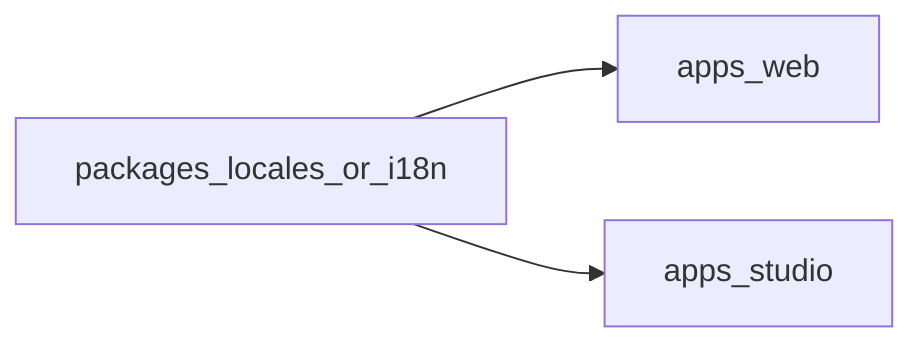

# Batch 2: WS-D + WS-E (post WS-B/C/J)

## Current baseline (verified)

- **Routing / i18n**: [`apps/web/src/lib/i18n/locales.ts`](apps/web/src/lib/i18n/locales.ts), stub pages [`apps/web/src/pages/en/index.astro`](apps/web/src/pages/en/index.astro), [`LanguageSwitcher.astro`](apps/web/src/components/LanguageSwitcher.astro). WS-B notes: browser redirect and missing-translation behavior still depend on CMS wiring in F–I.
- **Schemas**: Registered in [`apps/studio/schemas/index.ts`](apps/studio/schemas/index.ts); translatable docs use `locale` + `translationOf` (e.g. [`apps/studio/schemas/documents/page.ts`](apps/studio/schemas/documents/page.ts)). Contact copy lives in [`apps/studio/schemas/objects/contactFormConfig.ts`](apps/studio/schemas/objects/contactFormConfig.ts).
- **Studio config**: [`apps/studio/sanity.config.ts`](apps/studio/sanity.config.ts) is schema-only—**no desk `structure` yet** (main WS-D hook).
- **Deploy / CI**: [`docs/ws-j-deploy-ci-env.md`](docs/ws-j-deploy-ci-env.md); root scripts in [`package.json`](package.json) remain the contract (`lint`, `typecheck`, `build`, `build:web`, `deploy:studio`).
- **Gap vs constraints**: Locale labels/values are **duplicated** in Studio field `options.list` vs web `supportedLocales`. WS-A handoff explicitly asked for a **shared locale source**; there is still **no** [`packages/*`](packages/) workspace—address this in Batch 2.

## WS-D — Studio desk structure and editor guardrails

**Goals**

- Editor-friendly **navigation**: group singletons, pages by type/locale, content types (posts, resources, events), taxonomy.
- **Translation maintenance**: list views or filters that make `translationOf` + non-English locales obvious; optional “create translation” patterns via initial values (e.g. copy title placeholder, require `translationOf`).
- **Guardrails**: strengthen field `description`s where helpful; **initial values** for common patterns (e.g. contact `formName`, page `locale`); consider **custom document action** for a lightweight publish checklist (master plan WS-D discovery: default proposal = **warnings-first** checklist via toast or dialog, not hard-blocking publish, unless you later tighten).
- **Config**: register `structureTool` (and default `visionTool` if desired) in [`sanity.config.ts`](apps/studio/sanity.config.ts); add [`structure`](https://www.sanity.io/docs/structure-builder-introduction) implementation (new file e.g. `apps/studio/structure/index.ts` or `deskStructure.ts`).

**Shared locales (required for constraint parity)**

- Add a small workspace package (e.g. `packages/locales` or `packages/i18n`) exporting:
  - `supportedLocales` (single source of truth, matching current web contract),
  - human-readable **titles** for Studio `options.list`,
  - optional helpers (e.g. `isRtlLocale`) for later WS-E.
- Wire **web** [`locales.ts`](apps/web/src/lib/i18n/locales.ts) to import constants from that package (re-export helpers there for minimal churn).
- Wire **Studio** document schemas to build `locale` field `list` from the same export so lists cannot drift.

**Out of scope / deferrals (unless trivial)**

- Full **Presentation / preview** URLs: treat as **Phase 2** unless you add a minimal preview URL env in WS-D (adds Astro base URL + token complexity).
- **Roles**: single editor remains; document “future role split” in WS-K only.

**Acceptance criteria**

- Studio sidebar reflects logical groups; editors can find Home/About/Contact pages and translations without raw type clutter.
- Locale options in Studio match web `supportedLocales` exactly (one module).
- `npm run typecheck` passes for studio + web after package wiring.
- No regression to WS-C validations or contact Netlify field requirements.

## WS-E — Design system, global chrome, accessibility

**Goals**

- **Brand asset**: Use the official circular Bay Ridge Tenant Union logo (bridge mark + ring type). **Implementation**: copy the handoff PNG (`brtu-logo-703359c5-86a2-4d51-9861-77c093d7e242.png` from the session/design assets) into the repo at [`apps/web/public/images/brtu-logo.png`](apps/web/public/images/brtu-logo.png) so Astro/Netlify serve a stable URL. Header (and optional footer) should use this file with meaningful `alt` text (organization name).
- **Tokens**: CSS variables or a small token file grounded in **logo colors**, tuned for **WCAG 2.1 AA** (and AAA where cheap):
  - **Primary / accent**: union red, baseline hex **`#C82327`** (primary actions, key links, focus accents where contrast allows).
  - **Neutrals**: **`#FFFFFF`** page/surface background; **`#000000`** or soft black **`#1A1A1A`** for primary text and strong chrome (matches logo black ring / bridge mass).
  - **Accessibility rules for red**: saturated red often **fails** as *body-sized text* on white at AA; treat **`#C82327` as fill** for buttons and large UI chrome, paired with **white** label text (verify 4.5:1+ for text on red, or use slightly darker red for filled buttons if needed). For **inline text links** on white, prefer **black/charcoal underline + red on hover/focus**, or a **darker red** token validated for 4.5:1 on white—do not assume logo red works for small text without a check.
  - Extend tokens for **borders**, **muted text** (e.g. gray derived from black mix, not from red), and **focus ring** (visible on both light and dark surfaces; often high-contrast outline using primary or black).
- **Typography**: **System font stack** for body (privacy/latency; WS-B already allows system fonts). Headings can stay system UI bold to echo the logo’s heavy sans without loading Google Fonts; optional later: a single self-hosted bold face if brand tightens.
- **Global layout**: base layout partial or Astro component(s) for `<html lang>` / future `dir` for `ar`, skip link, header/footer shells, main landmark.
- **Components**: button, link, card, **prose** wrapper for rich text (when Portable Text renders in F–I), image patterns with lazy loading and alt-text discipline aligned with schema.
- **RTL hooks**: layout utilities or `dir`-aware spacing so Arabic can ship without a full redesign (WS-B: system font OK initially).

**Constraints**

- Do **not** hardcode Contact form strings—**WS-F** consumes [`contactFormConfig`](apps/studio/schemas/objects/contactFormConfig.ts) only.
- Reuse **locale** from shared package for `lang` (and future `dir`) on layouts.

**Other WS-E defaults**

- **Minimal motion**; respect `prefers-reduced-motion`. Footer legal links can stay minimal for MVP (expand in Phase 2).

**Acceptance criteria**

- Reusable layout used by at least the existing locale index page (and ready for F–I routes).
- Documented short **a11y checklist** for components (focus visible, heading order guidance, reduced motion)—can live as a short comment block in layout or a tiny `docs/` note only if you already document WS-E elsewhere; avoid new markdown files unless the team wants them (user preference: no unsolicited docs).

## After WS-D + WS-E: WS-F / G / H / I in parallel

| Workstream | Depends on | Contract to honor |
|------------|------------|-------------------|
| **WS-F** Marketing pages | E layout, C pages + contact, B routes | Query pages by `pageType` + `locale`; form from schema; `/en/...` canonical |
| **WS-G** Blog | E, C post | Localized slugs + `translationOf` fallback rules from WS-B |
| **WS-H** Resources | E, C resource + category | Single file, categories, stable slugs |
| **WS-I** Events | E, C event | ICS + Google links at build/render time; no all-day |

Update **`publishedLocales`** in shared locale module (or derived from build-time Sanity query) when non-English content goes live so the language switcher matches WS-B “published only” rule.

## Risks

- **Workspace package churn**: adding `packages/*` requires root `workspaces` update and Studio/web `package.json` dependencies—keep the package dependency-free or minimal.
- **Studio bundler**: ensure Sanity can resolve the shared package (path or workspace name); verify `sanity dev` and `sanity build`.

## Suggested implementation order

1. **Shared locales package** + refactor web + Studio schemas (unblocks both D and E).
2. **WS-D** structure + templates/checklist.
3. **WS-E** global styles + layout + primitives.
4. Spin **WS-F–I** in parallel with shared layout and GROQ contracts documented from WS-C.
